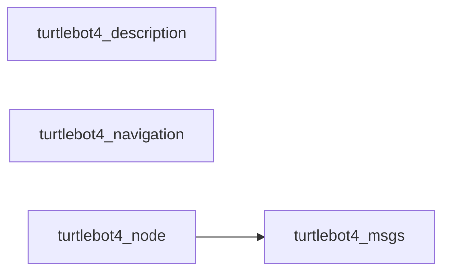
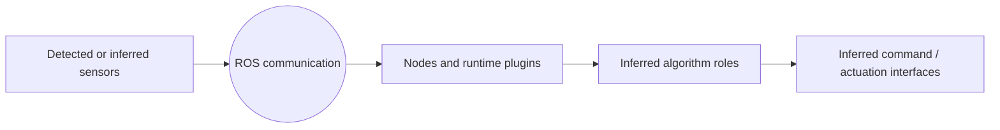

# turtlebot4 — Basic ROS 2 Overview

## Scope

Static analysis detected 4 package(s), 4 launch file(s), 3 node declaration(s), and 19 resolved topic(s). This is a static report: **detected** items come directly from files; **inferred** items are cautious architectural classifications; **diagnostic** items are checks that may require runtime confirmation.

## What Was Found

| Item | Count |
| --- | --- |
| Packages | 4 |
| Launch Files | 4 |
| Nodes | 3 |
| Topics | 19 |
| Services | 6 |
| Actions | 6 |
| Resolved Entities | 38 |
| Unresolved Entities | 1 |
| Skipped Files | 0 |

| Diagnostic severity | Count |
| --- | --- |
| info | 33 |

## Package Map

| Package | Path | Build type | Detected contents | Dependencies | Certainty |
| --- | --- | --- | --- | --- | --- |
| turtlebot4_description | turtlebot4_description | ament_cmake | 1 launch, 2 nodes | ament_cmake, ament_lint_auto, ament_lint_common, irobot_create_description, joint_state_publisher, robot_state_publisher, urdf | detected 100% |
| turtlebot4_msgs | turtlebot4_msgs | ament_cmake | 3 interfaces | ament_cmake, ament_lint_auto, ament_lint_common, rosidl_default_generators, rosidl_default_runtime, std_msgs | detected 100% |
| turtlebot4_navigation | turtlebot4_navigation | ament_cmake | 3 launch, 2 topics, 2 actions | ament_cmake, ament_cmake_python, ament_lint_auto, ament_lint_common, nav2_bringup, nav2_simple_commander, slam_toolbox | detected 100% |
| turtlebot4_node | turtlebot4_node | ament_cmake | 1 executables, 1 nodes, 18 topics, 6 services, 4 actions | ament_cmake, ament_lint_auto, ament_lint_common, irobot_create_msgs, rclcpp, rclcpp_action, rcutils, sensor_msgs | detected 100% |

## High-Level Flow

This flow is an architectural summary, not a proven runtime graph. Component roles are only listed when source evidence supports an inference.

## Main Nodes

| Package | Node | Namespace | Executable | Origin | Active | Interfaces | Effective parameters | Certainty |
| --- | --- | --- | --- | --- | --- | --- | --- | --- |
| turtlebot4_navigation | <unresolved> |  |  | source_scope | yes | 4 | 0 | inferred 58% |
| turtlebot4_node | turtlebot4_node |  | turtlebot4_node | source | yes | 28 | 5 | detected 100% |
| robot_state_publisher | robot_state_publisher |  | robot_state_publisher | launch | yes | 0 | 2 | detected 100% |
| joint_state_publisher | joint_state_publisher |  | joint_state_publisher | launch | yes | 0 | 1 | detected 100% |

## Sensors And Inputs

| Package | Name | Type | Role | Location | Certainty |
| --- | --- | --- | --- | --- | --- |
|  | rgbd_camera | rgbd_camera |  | turtlebot4_description/urdf/sensors/oakd.urdf.xacro:124 | detected 96% |
| turtlebot4_node | battery_state | sensor_msgs/msg/BatteryState | sensor data interface | turtlebot4_node/src/turtlebot4.cpp:133 | inferred 78% |

## Control Algorithms And Plugins

| Package | Component | Detected type | Inferred role | Location | Certainty |
| --- | --- | --- | --- | --- | --- |
| turtlebot4_navigation | nav2_bt_navigator::NavigateToPoseNavigator | runtime plugin | runtime plugin | turtlebot4_navigation/config/nav2.yaml:13 | inferred 78% |
| turtlebot4_navigation | nav2_bt_navigator::NavigateThroughPosesNavigator | runtime plugin | runtime plugin | turtlebot4_navigation/config/nav2.yaml:15 | inferred 78% |
| turtlebot4_navigation | nav2_controller::SimpleProgressChecker | control | control | turtlebot4_navigation/config/nav2.yaml:33 | inferred 78% |
| turtlebot4_navigation | nav2_controller::SimpleGoalChecker | control | control | turtlebot4_navigation/config/nav2.yaml:38 | inferred 78% |
| turtlebot4_navigation | nav2_mppi_controller::MPPIController | control | control | turtlebot4_navigation/config/nav2.yaml:42 | inferred 78% |
| turtlebot4_navigation | nav2_costmap_2d::InflationLayer | environment model | environment model | turtlebot4_navigation/config/nav2.yaml:148 | inferred 78% |
| turtlebot4_navigation | nav2_costmap_2d::VoxelLayer | environment model | environment model | turtlebot4_navigation/config/nav2.yaml:152 | inferred 78% |
| turtlebot4_navigation | nav2_costmap_2d::StaticLayer | environment model | environment model | turtlebot4_navigation/config/nav2.yaml:172 | inferred 78% |
| turtlebot4_navigation | nav2_costmap_2d::ObstacleLayer | environment model | environment model | turtlebot4_navigation/config/nav2.yaml:196 | inferred 78% |
| turtlebot4_navigation | nav2_costmap_2d::StaticLayer | environment model | environment model | turtlebot4_navigation/config/nav2.yaml:210 | inferred 78% |
| turtlebot4_navigation | nav2_costmap_2d::InflationLayer | environment model | environment model | turtlebot4_navigation/config/nav2.yaml:213 | inferred 78% |
| turtlebot4_navigation | nav2_navfn_planner::NavfnPlanner | planning | planning | turtlebot4_navigation/config/nav2.yaml:224 | inferred 78% |

## Commands And Actuation

| Package | Interface | Type | Role | Location | Certainty |
| --- | --- | --- | --- | --- | --- |
| turtlebot4_node | hmi/led/_motors | std_msgs/msg/Int32 | command or actuation interface | turtlebot4_node/src/leds.cpp:48 | inferred 75% |
| turtlebot4_node | start_motor | std_srvs/srv/Empty | command or actuation interface | turtlebot4_node/src/turtlebot4.cpp:166 | inferred 75% |
| turtlebot4_node | stop_motor | std_srvs/srv/Empty | command or actuation interface | turtlebot4_node/src/turtlebot4.cpp:169 | inferred 75% |

## Where To Make Changes

| Task | Package | Path | Why this path | Certainty | Evidence |
| --- | --- | --- | --- | --- | --- |
| Change startup, composition, namespaces, or remappings | turtlebot4_description | turtlebot4_description/launch/robot_description.launch.py | launch entry point detected | inferred 85% | turtlebot4_description/launch/robot_description.launch.py:1 (launch_classifier) |
| Change robot geometry, joints, sensors, or frame structure | turtlebot4_description | turtlebot4_description/urdf/lite/turtlebot4.urdf.xacro | URDF/Xacro model detected | inferred 90% | turtlebot4_description/urdf/lite/turtlebot4.urdf.xacro:1 (path_classifier) |
| Change a ROS message, service, or action contract | turtlebot4_msgs | turtlebot4_msgs/msg/UserButton.msg | custom interface detected | inferred 90% | turtlebot4_msgs/msg/UserButton.msg:1 (ros_interface_parser) |
| Change startup, composition, namespaces, or remappings | turtlebot4_navigation | turtlebot4_navigation/launch/localization.launch.py | launch entry point detected | inferred 85% | turtlebot4_navigation/launch/localization.launch.py:1 (launch_classifier) |
| Tune runtime behavior and algorithm settings | turtlebot4_navigation | turtlebot4_navigation/config/localization.yaml | ROS parameter file detected | inferred 82% | turtlebot4_navigation/config/localization.yaml:1 (yaml_parameter_tree) |
| Change node behavior or ROS communication | turtlebot4_navigation | turtlebot4_navigation/turtlebot4_navigation/turtlebot4_navigator.py | source file contains ROS entities | inferred 80% | turtlebot4_navigation/turtlebot4_navigation/turtlebot4_navigator.py:58 (python_ast) |
| Change node behavior or ROS communication | turtlebot4_node | turtlebot4_node/src/turtlebot4.cpp | source file contains ROS entities | inferred 80% | turtlebot4_node/src/turtlebot4.cpp:149 (cpp_call_parser) |

## Important Findings

| Severity | Code | Finding | Meaning | Certainty | Evidence |
| --- | --- | --- | --- | --- | --- |
| info | RD101 | Possible undeclared dependency | turtlebot4_navigation references 'action_msgs' but package.xml does not declare it. This reference is indirect and may be a namespace, test-only import, or transitive dependency. | diagnostic 58% | turtlebot4_navigation/turtlebot4_navigation/turtlebot4_navigator.py:1 (python_import) |
| info | RD101 | Possible undeclared dependency | turtlebot4_navigation references 'geometry_msgs' but package.xml does not declare it. This reference is indirect and may be a namespace, test-only import, or transitive dependency. | diagnostic 58% | turtlebot4_navigation/turtlebot4_navigation/turtlebot4_navigator.py:1 (python_import) |
| info | RD101 | Possible undeclared dependency | turtlebot4_navigation references 'irobot_create_msgs' but package.xml does not declare it. This reference is indirect and may be a namespace, test-only import, or transitive dependency. | diagnostic 58% | turtlebot4_navigation/turtlebot4_navigation/turtlebot4_navigator.py:1 (python_import) |
| info | RD101 | Possible undeclared dependency | turtlebot4_navigation references 'rclpy' but package.xml does not declare it. This reference is indirect and may be a namespace, test-only import, or transitive dependency. | diagnostic 58% | turtlebot4_navigation/turtlebot4_navigation/turtlebot4_navigator.py:1 (python_import) |
| info | RD202 | Orphan topic endpoint | Topic 'battery_state' has no statically detected publisher. Runtime or external nodes may provide it. | diagnostic 62% | turtlebot4_node/src/turtlebot4.cpp:133 (cpp_call_parser) |
| info | RD202 | Orphan topic endpoint | Topic 'dock_status' has no statically detected publisher. Runtime or external nodes may provide it. | diagnostic 62% | turtlebot4_navigation/turtlebot4_navigation/turtlebot4_navigator.py:58 (python_ast) |
| info | RD202 | Orphan topic endpoint | Topic 'function_calls' has no statically detected subscriber. Runtime or external nodes may provide it. | diagnostic 62% | turtlebot4_node/src/turtlebot4.cpp:153 (cpp_call_parser) |
| info | RD202 | Orphan topic endpoint | Topic 'hmi/buttons' has no statically detected publisher. Runtime or external nodes may provide it. | diagnostic 62% | turtlebot4_node/src/buttons.cpp:48 (cpp_call_parser) |
| info | RD202 | Orphan topic endpoint | Topic 'hmi/display' has no statically detected subscriber. Runtime or external nodes may provide it. | diagnostic 62% | turtlebot4_node/src/display.cpp:48 (cpp_call_parser) |
| info | RD202 | Orphan topic endpoint | Topic 'hmi/display/message' has no statically detected publisher. Runtime or external nodes may provide it. | diagnostic 62% | turtlebot4_node/src/display.cpp:51 (cpp_call_parser) |
| info | RD202 | Orphan topic endpoint | Topic 'hmi/led' has no statically detected publisher. Runtime or external nodes may provide it. | diagnostic 62% | turtlebot4_node/src/leds.cpp:42 (cpp_call_parser) |
| info | RD202 | Orphan topic endpoint | Topic 'hmi/led/_battery' has no statically detected subscriber. Runtime or external nodes may provide it. | diagnostic 62% | turtlebot4_node/src/leds.cpp:51 (cpp_method_wrapper_resolution) |
| info | RD202 | Orphan topic endpoint | Topic 'hmi/led/_comms' has no statically detected subscriber. Runtime or external nodes may provide it. | diagnostic 62% | turtlebot4_node/src/leds.cpp:49 (cpp_method_wrapper_resolution) |
| info | RD202 | Orphan topic endpoint | Topic 'hmi/led/_motors' has no statically detected subscriber. Runtime or external nodes may provide it. | diagnostic 62% | turtlebot4_node/src/leds.cpp:48 (cpp_method_wrapper_resolution) |
| info | RD202 | Orphan topic endpoint | Topic 'hmi/led/_power' has no statically detected subscriber. Runtime or external nodes may provide it. | diagnostic 62% | turtlebot4_node/src/leds.cpp:47 (cpp_method_wrapper_resolution) |
