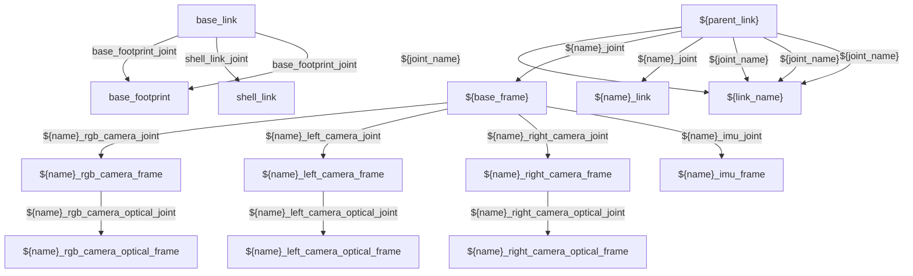

# turtlebot4 — Expert ROS 2 Static Analysis

## Analysis Contract

- Schema: `1.2.0`
- Scanner: `robot-doctor-static 0.5.0`
- Mode: `static`
- Fact classes: detected, inferred, diagnostic

Static analysis detected 4 package(s), 4 launch file(s), 3 node declaration(s), and 19 resolved topic(s). Every inventory item carries evidence and confidence in the JSON output. Unresolved expressions remain visible rather than becoming empty names.

## Complete Package Inventory

| Package | Path | Build type | Detected contents | Dependencies | Certainty |
| --- | --- | --- | --- | --- | --- |
| turtlebot4_description | turtlebot4_description | ament_cmake | 1 launch, 2 nodes | ament_cmake, ament_lint_auto, ament_lint_common, irobot_create_description, joint_state_publisher, robot_state_publisher, urdf | detected 100% |
| turtlebot4_msgs | turtlebot4_msgs | ament_cmake | 3 interfaces | ament_cmake, ament_lint_auto, ament_lint_common, rosidl_default_generators, rosidl_default_runtime, std_msgs | detected 100% |
| turtlebot4_navigation | turtlebot4_navigation | ament_cmake | 3 launch, 2 topics, 2 actions | ament_cmake, ament_cmake_python, ament_lint_auto, ament_lint_common, nav2_bringup, nav2_simple_commander, slam_toolbox | detected 100% |
| turtlebot4_node | turtlebot4_node | ament_cmake | 1 executables, 1 nodes, 18 topics, 6 services, 4 actions | ament_cmake, ament_lint_auto, ament_lint_common, irobot_create_msgs, rclcpp, rclcpp_action, rcutils, sensor_msgs | detected 100% |

## Launch Topology

```mermaid
flowchart TD
  launch_turtlebot4_description_launch_robot_description_launch_py["turtlebot4_description/launch/robot_description.launch.py"]
  launch_turtlebot4_description_launch_robot_description_launch_py --> action_turtlebot4_description_launch_robot_description_launch_py_0["robot_state_publisher/robot_state_publisher"]
  launch_turtlebot4_description_launch_robot_description_launch_py --> action_turtlebot4_description_launch_robot_description_launch_py_1["joint_state_publisher/joint_state_publisher"]
  launch_turtlebot4_navigation_launch_localization_launch_py["turtlebot4_navigation/launch/localization.launch.py"]
  launch_turtlebot4_navigation_launch_nav2_launch_py["turtlebot4_navigation/launch/nav2.launch.py"]
  launch_turtlebot4_navigation_launch_slam_launch_py["turtlebot4_navigation/launch/slam.launch.py"]
  launch_turtlebot4_navigation_launch_localization_launch_py -.-> include__find_pkg_share_nav2_bringup_launch_localization_launch_py0["$(find-pkg-share nav2_bringup)/launch/localization_launch.py"]
  launch_turtlebot4_navigation_launch_nav2_launch_py -.-> include__find_pkg_share_nav2_bringup_launch_navigation_launch_py1["$(find-pkg-share nav2_bringup)/launch/navigation_launch.py"]
  launch_turtlebot4_navigation_launch_slam_launch_py -.-> include__find_pkg_share_slam_toolbox_launch_online_sync_launch_py2["$(find-pkg-share slam_toolbox)/launch/online_sync_launch.py"]
  launch_turtlebot4_navigation_launch_slam_launch_py -.-> include__find_pkg_share_slam_toolbox_launch_online_async_launch_py3["$(find-pkg-share slam_toolbox)/launch/online_async_launch.py"]
```

| Owner | Launch file | Entry kind | Target | Arguments/modifiers | Certainty |
| --- | --- | --- | --- | --- | --- |
| turtlebot4_description | turtlebot4_description/launch/robot_description.launch.py | launch file | python |  | detected 100% |
| turtlebot4_description | turtlebot4_description/launch/robot_description.launch.py | node | robot_state_publisher/robot_state_publisher | 2 remap(s), 2 parameter source(s) | detected 100% |
| turtlebot4_description | turtlebot4_description/launch/robot_description.launch.py | node | joint_state_publisher/joint_state_publisher | 2 remap(s), 1 parameter source(s) | detected 100% |
| turtlebot4_navigation | turtlebot4_navigation/launch/localization.launch.py | launch file | python |  | detected 100% |
| turtlebot4_navigation | turtlebot4_navigation/launch/localization.launch.py | namespace | $(var namespace) |  | detected 92% |
| turtlebot4_navigation | turtlebot4_navigation/launch/localization.launch.py | include | $(find-pkg-share nav2_bringup)/launch/localization_launch.py | {'namespace': namespace, 'map': LaunchConfiguration('map'), 'use_sim_time': use_sim_time, 'params_file': LaunchConfiguration('params')}.items() | detected 92% |
| turtlebot4_navigation | turtlebot4_navigation/launch/nav2.launch.py | launch file | python |  | detected 100% |
| turtlebot4_navigation | turtlebot4_navigation/launch/nav2.launch.py | namespace | $(var namespace) |  | detected 92% |
| turtlebot4_navigation | turtlebot4_navigation/launch/nav2.launch.py | remap | /namespace.perform(context)/global_costmap/scan |  | detected 85% |
| turtlebot4_navigation | turtlebot4_navigation/launch/nav2.launch.py | remap | /namespace.perform(context)/local_costmap/scan |  | detected 85% |
| turtlebot4_navigation | turtlebot4_navigation/launch/nav2.launch.py | include | $(find-pkg-share nav2_bringup)/launch/navigation_launch.py | [('use_sim_time', use_sim_time), ('params_file', nav2_params.perform(context)), ('use_composition', 'False'), ('namespace', namespace_str)] | detected 92% |
| turtlebot4_navigation | turtlebot4_navigation/launch/slam.launch.py | launch file | python |  | detected 100% |
| turtlebot4_navigation | turtlebot4_navigation/launch/slam.launch.py | namespace | $(var namespace) |  | detected 92% |
| turtlebot4_navigation | turtlebot4_navigation/launch/slam.launch.py | remap | /tf |  | detected 100% |
| turtlebot4_navigation | turtlebot4_navigation/launch/slam.launch.py | remap | /tf_static |  | detected 100% |
| turtlebot4_navigation | turtlebot4_navigation/launch/slam.launch.py | include | $(find-pkg-share slam_toolbox)/launch/online_sync_launch.py | [('use_sim_time', use_sim_time), ('autostart', autostart), ('use_lifecycle_manager', use_lifecycle_manager), ('slam_params_file', rewritten_slam_params)] | detected 92% |
| turtlebot4_navigation | turtlebot4_navigation/launch/slam.launch.py | include | $(find-pkg-share slam_toolbox)/launch/online_async_launch.py | [('use_sim_time', use_sim_time), ('autostart', autostart), ('use_lifecycle_manager', use_lifecycle_manager), ('slam_params_file', rewritten_slam_params)] | detected 92% |

## Communication Graph

```mermaid
flowchart LR
  topic_battery_state(("battery_state"))
  topic_battery_state --> sub_battery_state_turtlebot4_node_0["turtlebot4_node subscriber"]
  topic_dock_status(("dock_status"))
  topic_dock_status --> sub_dock_status_turtlebot4_navigation_0["turtlebot4_navigation subscriber"]
  topic_dock_status --> sub_dock_status_turtlebot4_node_1["turtlebot4_node subscriber"]
  topic_function_calls(("function_calls"))
  pub_function_calls_turtlebot4_node_0["turtlebot4_node publisher"] --> topic_function_calls
  topic_hmi_buttons(("hmi/buttons"))
  topic_hmi_buttons --> sub_hmi_buttons_turtlebot4_node_0["turtlebot4_node subscriber"]
  topic_hmi_display(("hmi/display"))
  pub_hmi_display_turtlebot4_node_0["turtlebot4_node publisher"] --> topic_hmi_display
  topic_hmi_display_message(("hmi/display/message"))
  topic_hmi_display_message --> sub_hmi_display_message_turtlebot4_node_0["turtlebot4_node subscriber"]
  topic_hmi_led(("hmi/led"))
  topic_hmi_led --> sub_hmi_led_turtlebot4_node_0["turtlebot4_node subscriber"]
  topic_hmi_led__battery(("hmi/led/_battery"))
  pub_hmi_led__battery_turtlebot4_node_0["turtlebot4_node publisher"] --> topic_hmi_led__battery
  topic_hmi_led__comms(("hmi/led/_comms"))
  pub_hmi_led__comms_turtlebot4_node_0["turtlebot4_node publisher"] --> topic_hmi_led__comms
  topic_hmi_led__motors(("hmi/led/_motors"))
  pub_hmi_led__motors_turtlebot4_node_0["turtlebot4_node publisher"] --> topic_hmi_led__motors
  topic_hmi_led__power(("hmi/led/_power"))
  pub_hmi_led__power_turtlebot4_node_0["turtlebot4_node publisher"] --> topic_hmi_led__power
  topic_hmi_led__user1(("hmi/led/_user1"))
  pub_hmi_led__user1_turtlebot4_node_0["turtlebot4_node publisher"] --> topic_hmi_led__user1
  topic_hmi_led__user2(("hmi/led/_user2"))
  pub_hmi_led__user2_turtlebot4_node_0["turtlebot4_node publisher"] --> topic_hmi_led__user2
  topic_hmi_led__wifi(("hmi/led/_wifi"))
  pub_hmi_led__wifi_turtlebot4_node_0["turtlebot4_node publisher"] --> topic_hmi_led__wifi
  topic_initialpose(("initialpose"))
  topic_initialpose --> sub_initialpose_turtlebot4_navigation_0["turtlebot4_navigation subscriber"]
  topic_interface_buttons(("interface_buttons"))
  topic_interface_buttons --> sub_interface_buttons_turtlebot4_node_0["turtlebot4_node subscriber"]
  topic_ip(("ip"))
  pub_ip_turtlebot4_node_0["turtlebot4_node publisher"] --> topic_ip
  topic_joy(("joy"))
  topic_joy --> sub_joy_turtlebot4_node_0["turtlebot4_node subscriber"]
  topic_wheel_status(("wheel_status"))
  topic_wheel_status --> sub_wheel_status_turtlebot4_node_0["turtlebot4_node subscriber"]
```

## Node-Level Architecture

```mermaid
flowchart LR
  source_turtlebot4_navigation_unresolved_turtlebot4_navigation_turtlebot4_navigation_turtlebot4_navigator_py["/unresolved\nturtlebot4_navigation"]
  topic_dock_status(("dock_status"))
  topic_dock_status --> source_turtlebot4_navigation_unresolved_turtlebot4_navigation_turtlebot4_navigation_turtlebot4_navigator_py
  topic_initialpose(("initialpose"))
  topic_initialpose --> source_turtlebot4_navigation_unresolved_turtlebot4_navigation_turtlebot4_navigation_turtlebot4_navigator_py
  action_undock[["undock"]]
  source_turtlebot4_navigation_unresolved_turtlebot4_navigation_turtlebot4_navigation_turtlebot4_navigator_py --> action_undock
  action_dock[["dock"]]
  source_turtlebot4_navigation_unresolved_turtlebot4_navigation_turtlebot4_navigation_turtlebot4_navigator_py --> action_dock
  source_turtlebot4_node_turtlebot4_node_turtlebot4_node_src_turtlebot4_cpp["/turtlebot4_node\nturtlebot4_node"]
  topic_hmi_display(("hmi/display"))
  source_turtlebot4_node_turtlebot4_node_turtlebot4_node_src_turtlebot4_cpp --> topic_hmi_display
  topic_hmi_led__power(("hmi/led/_power"))
  source_turtlebot4_node_turtlebot4_node_turtlebot4_node_src_turtlebot4_cpp --> topic_hmi_led__power
  topic_hmi_led__motors(("hmi/led/_motors"))
  source_turtlebot4_node_turtlebot4_node_turtlebot4_node_src_turtlebot4_cpp --> topic_hmi_led__motors
  topic_hmi_led__comms(("hmi/led/_comms"))
  source_turtlebot4_node_turtlebot4_node_turtlebot4_node_src_turtlebot4_cpp --> topic_hmi_led__comms
  topic_hmi_led__wifi(("hmi/led/_wifi"))
  source_turtlebot4_node_turtlebot4_node_turtlebot4_node_src_turtlebot4_cpp --> topic_hmi_led__wifi
  topic_hmi_led__battery(("hmi/led/_battery"))
  source_turtlebot4_node_turtlebot4_node_turtlebot4_node_src_turtlebot4_cpp --> topic_hmi_led__battery
  topic_hmi_led__user1(("hmi/led/_user1"))
  source_turtlebot4_node_turtlebot4_node_turtlebot4_node_src_turtlebot4_cpp --> topic_hmi_led__user1
  topic_hmi_led__user2(("hmi/led/_user2"))
  source_turtlebot4_node_turtlebot4_node_turtlebot4_node_src_turtlebot4_cpp --> topic_hmi_led__user2
  topic_ip(("ip"))
  source_turtlebot4_node_turtlebot4_node_turtlebot4_node_src_turtlebot4_cpp --> topic_ip
  topic_function_calls(("function_calls"))
  source_turtlebot4_node_turtlebot4_node_turtlebot4_node_src_turtlebot4_cpp --> topic_function_calls
  topic_interface_buttons(("interface_buttons"))
  topic_interface_buttons --> source_turtlebot4_node_turtlebot4_node_turtlebot4_node_src_turtlebot4_cpp
  topic_joy(("joy"))
  topic_joy --> source_turtlebot4_node_turtlebot4_node_turtlebot4_node_src_turtlebot4_cpp
  topic_hmi_buttons(("hmi/buttons"))
  topic_hmi_buttons --> source_turtlebot4_node_turtlebot4_node_turtlebot4_node_src_turtlebot4_cpp
  topic_hmi_display_message(("hmi/display/message"))
  topic_hmi_display_message --> source_turtlebot4_node_turtlebot4_node_turtlebot4_node_src_turtlebot4_cpp
  topic_hmi_led(("hmi/led"))
  topic_hmi_led --> source_turtlebot4_node_turtlebot4_node_turtlebot4_node_src_turtlebot4_cpp
  topic_battery_state(("battery_state"))
  topic_battery_state --> source_turtlebot4_node_turtlebot4_node_turtlebot4_node_src_turtlebot4_cpp
  topic_dock_status(("dock_status"))
  topic_dock_status --> source_turtlebot4_node_turtlebot4_node_turtlebot4_node_src_turtlebot4_cpp
  topic_wheel_status(("wheel_status"))
  topic_wheel_status --> source_turtlebot4_node_turtlebot4_node_turtlebot4_node_src_turtlebot4_cpp
  service_e_stop{{"e_stop"}}
  source_turtlebot4_node_turtlebot4_node_turtlebot4_node_src_turtlebot4_cpp --> service_e_stop
  service_robot_power{{"robot_power"}}
  source_turtlebot4_node_turtlebot4_node_turtlebot4_node_src_turtlebot4_cpp --> service_robot_power
  service_start_motor{{"start_motor"}}
  source_turtlebot4_node_turtlebot4_node_turtlebot4_node_src_turtlebot4_cpp --> service_start_motor
  service_stop_motor{{"stop_motor"}}
  source_turtlebot4_node_turtlebot4_node_turtlebot4_node_src_turtlebot4_cpp --> service_stop_motor
  service_oakd_start_camera{{"oakd/start_camera"}}
  source_turtlebot4_node_turtlebot4_node_turtlebot4_node_src_turtlebot4_cpp --> service_oakd_start_camera
  service_oakd_stop_camera{{"oakd/stop_camera"}}
  source_turtlebot4_node_turtlebot4_node_turtlebot4_node_src_turtlebot4_cpp --> service_oakd_stop_camera
  action_dock[["dock"]]
  source_turtlebot4_node_turtlebot4_node_turtlebot4_node_src_turtlebot4_cpp --> action_dock
  action_undock[["undock"]]
  source_turtlebot4_node_turtlebot4_node_turtlebot4_node_src_turtlebot4_cpp --> action_undock
  action_wall_follow[["wall_follow"]]
  source_turtlebot4_node_turtlebot4_node_turtlebot4_node_src_turtlebot4_cpp --> action_wall_follow
  action_led_animation[["led_animation"]]
  source_turtlebot4_node_turtlebot4_node_turtlebot4_node_src_turtlebot4_cpp --> action_led_animation
  launch_turtlebot4_description_launch_robot_description_launch_py_0_robot_state_publisher["/robot_state_publisher\nrobot_state_publisher"]
  launch_turtlebot4_description_launch_robot_description_launch_py_1_joint_state_publisher["/joint_state_publisher\njoint_state_publisher"]
```

| Package | Node | Namespace | Executable | Origin | Active | Interfaces | Effective parameters | Certainty |
| --- | --- | --- | --- | --- | --- | --- | --- | --- |
| turtlebot4_navigation | <unresolved> |  |  | source_scope | yes | 4 | 0 | inferred 58% |
| turtlebot4_node | turtlebot4_node |  | turtlebot4_node | source | yes | 28 | 5 | detected 100% |
| robot_state_publisher | robot_state_publisher |  | robot_state_publisher | launch | yes | 0 | 2 | detected 100% |
| joint_state_publisher | joint_state_publisher |  | joint_state_publisher | launch | yes | 0 | 1 | detected 100% |

### Publishers

| Package | Topic | Message type | QoS | Location | Certainty |
| --- | --- | --- | --- | --- | --- |
| turtlebot4_node | hmi/display | turtlebot4_msgs/msg/UserDisplay | expression=rclcpp::SensorDataQoS() | turtlebot4_node/src/display.cpp:48 | detected 100% |
| turtlebot4_node | hmi/led/_power | std_msgs/msg/Int32 |  | turtlebot4_node/src/leds.cpp:47 | detected 90% |
| turtlebot4_node | hmi/led/_motors | std_msgs/msg/Int32 |  | turtlebot4_node/src/leds.cpp:48 | detected 90% |
| turtlebot4_node | hmi/led/_comms | std_msgs/msg/Int32 |  | turtlebot4_node/src/leds.cpp:49 | detected 90% |
| turtlebot4_node | hmi/led/_wifi | std_msgs/msg/Int32 |  | turtlebot4_node/src/leds.cpp:50 | detected 90% |
| turtlebot4_node | hmi/led/_battery | std_msgs/msg/Int32 |  | turtlebot4_node/src/leds.cpp:51 | detected 90% |
| turtlebot4_node | hmi/led/_user1 | std_msgs/msg/Int32 |  | turtlebot4_node/src/leds.cpp:52 | detected 90% |
| turtlebot4_node | hmi/led/_user2 | std_msgs/msg/Int32 |  | turtlebot4_node/src/leds.cpp:53 | detected 90% |
| turtlebot4_node | ip | std_msgs/msg/String | expression=rclcpp::QoS(rclcpp::KeepLast(10)) | turtlebot4_node/src/turtlebot4.cpp:149 | detected 100% |
| turtlebot4_node | function_calls | std_msgs/msg/String | expression=rclcpp::QoS(rclcpp::KeepLast(10)) | turtlebot4_node/src/turtlebot4.cpp:153 | detected 100% |

### Subscribers

| Package | Topic | Message type | QoS | Location | Certainty |
| --- | --- | --- | --- | --- | --- |
| turtlebot4_navigation | dock_status | irobot_create_msgs/msg/DockStatus | expression=qos_profile_sensor_data, dynamic=yes | turtlebot4_navigation/turtlebot4_navigation/turtlebot4_navigator.py:58 | detected 100% |
| turtlebot4_navigation | initialpose | geometry_msgs/msg/PoseWithCovarianceStamped | expression=qos_profile_system_default, dynamic=yes | turtlebot4_navigation/turtlebot4_navigation/turtlebot4_navigator.py:63 | detected 100% |
| turtlebot4_node | interface_buttons | irobot_create_msgs/msg/InterfaceButtons | expression=rclcpp::SensorDataQoS() | turtlebot4_node/src/buttons.cpp:37 | detected 100% |
| turtlebot4_node | joy | sensor_msgs/msg/Joy | expression=rclcpp::QoS(10), depth=10 | turtlebot4_node/src/buttons.cpp:42 | detected 100% |
| turtlebot4_node | hmi/buttons | turtlebot4_msgs/msg/UserButton | expression=rclcpp::SensorDataQoS() | turtlebot4_node/src/buttons.cpp:48 | detected 100% |
| turtlebot4_node | hmi/display/message | std_msgs/msg/String | expression=rclcpp::SensorDataQoS() | turtlebot4_node/src/display.cpp:51 | detected 100% |
| turtlebot4_node | hmi/led | turtlebot4_msgs/msg/UserLed | expression=rclcpp::SensorDataQoS() | turtlebot4_node/src/leds.cpp:42 | detected 100% |
| turtlebot4_node | battery_state | sensor_msgs/msg/BatteryState | expression=rclcpp::SensorDataQoS() | turtlebot4_node/src/turtlebot4.cpp:133 | detected 100% |
| turtlebot4_node | dock_status | irobot_create_msgs/msg/DockStatus | expression=rclcpp::SensorDataQoS() | turtlebot4_node/src/turtlebot4.cpp:138 | detected 100% |
| turtlebot4_node | wheel_status | irobot_create_msgs/msg/WheelStatus | expression=rclcpp::SensorDataQoS() | turtlebot4_node/src/turtlebot4.cpp:143 | detected 100% |

### Service Servers

_None detected._

### Service Clients

| Package | Service | Type | Location | Certainty |
| --- | --- | --- | --- | --- |
| turtlebot4_node | e_stop | irobot_create_msgs/srv/EStop | turtlebot4_node/src/turtlebot4.cpp:164 | detected 94% |
| turtlebot4_node | robot_power | irobot_create_msgs/srv/RobotPower | turtlebot4_node/src/turtlebot4.cpp:165 | detected 94% |
| turtlebot4_node | start_motor | std_srvs/srv/Empty | turtlebot4_node/src/turtlebot4.cpp:166 | detected 94% |
| turtlebot4_node | stop_motor | std_srvs/srv/Empty | turtlebot4_node/src/turtlebot4.cpp:169 | detected 94% |
| turtlebot4_node | oakd/start_camera | std_srvs/srv/Trigger | turtlebot4_node/src/turtlebot4.cpp:172 | detected 94% |
| turtlebot4_node | oakd/stop_camera | std_srvs/srv/Trigger | turtlebot4_node/src/turtlebot4.cpp:175 | detected 94% |

### Action Servers

_None detected._

### Action Clients

| Package | Action | Type | Location | Certainty |
| --- | --- | --- | --- | --- |
| turtlebot4_navigation | undock | irobot_create_msgs/action/Undock | turtlebot4_navigation/turtlebot4_navigation/turtlebot4_navigator.py:68 | detected 100% |
| turtlebot4_navigation | dock | irobot_create_msgs/action/Dock | turtlebot4_navigation/turtlebot4_navigation/turtlebot4_navigator.py:69 | detected 100% |
| turtlebot4_node | dock | irobot_create_msgs/action/Dock | turtlebot4_node/src/turtlebot4.cpp:158 | detected 94% |
| turtlebot4_node | undock | irobot_create_msgs/action/Undock | turtlebot4_node/src/turtlebot4.cpp:159 | detected 94% |
| turtlebot4_node | wall_follow | irobot_create_msgs/action/WallFollow | turtlebot4_node/src/turtlebot4.cpp:160 | detected 94% |
| turtlebot4_node | led_animation | irobot_create_msgs/action/LedAnimation | turtlebot4_node/src/turtlebot4.cpp:161 | detected 94% |

### Resolved Service Graph

| Service | Types | Servers | Clients | Certainty |
| --- | --- | --- | --- | --- |
| e_stop | irobot_create_msgs/srv/EStop |  | turtlebot4_node | detected 94% |
| oakd/start_camera | std_srvs/srv/Trigger |  | turtlebot4_node | detected 94% |
| oakd/stop_camera | std_srvs/srv/Trigger |  | turtlebot4_node | detected 94% |
| robot_power | irobot_create_msgs/srv/RobotPower |  | turtlebot4_node | detected 94% |
| start_motor | std_srvs/srv/Empty |  | turtlebot4_node | detected 94% |
| stop_motor | std_srvs/srv/Empty |  | turtlebot4_node | detected 94% |

### Resolved Action Graph

| Action | Types | Servers | Clients | Certainty |
| --- | --- | --- | --- | --- |
| dock | irobot_create_msgs/action/Dock |  | source:turtlebot4_navigation:unresolved:turtlebot4_navigation/turtlebot4_navigation/turtlebot4_navigator.py, turtlebot4_node | detected 94% |
| led_animation | irobot_create_msgs/action/LedAnimation |  | turtlebot4_node | detected 94% |
| undock | irobot_create_msgs/action/Undock |  | source:turtlebot4_navigation:unresolved:turtlebot4_navigation/turtlebot4_navigation/turtlebot4_navigator.py, turtlebot4_node | detected 94% |
| wall_follow | irobot_create_msgs/action/WallFollow |  | turtlebot4_node | detected 94% |

## QoS Evidence

| Package | Endpoint | Name | Type | QoS | Location | Certainty |
| --- | --- | --- | --- | --- | --- | --- |
| turtlebot4_node | publisher | hmi/display | turtlebot4_msgs/msg/UserDisplay | expression=rclcpp::SensorDataQoS() | turtlebot4_node/src/display.cpp:48 | detected 100% |
| turtlebot4_node | publisher | ip | std_msgs/msg/String | expression=rclcpp::QoS(rclcpp::KeepLast(10)) | turtlebot4_node/src/turtlebot4.cpp:149 | detected 100% |
| turtlebot4_node | publisher | function_calls | std_msgs/msg/String | expression=rclcpp::QoS(rclcpp::KeepLast(10)) | turtlebot4_node/src/turtlebot4.cpp:153 | detected 100% |
| turtlebot4_navigation | subscription | dock_status | irobot_create_msgs/msg/DockStatus | expression=qos_profile_sensor_data, dynamic=yes | turtlebot4_navigation/turtlebot4_navigation/turtlebot4_navigator.py:58 | detected 100% |
| turtlebot4_navigation | subscription | initialpose | geometry_msgs/msg/PoseWithCovarianceStamped | expression=qos_profile_system_default, dynamic=yes | turtlebot4_navigation/turtlebot4_navigation/turtlebot4_navigator.py:63 | detected 100% |
| turtlebot4_node | subscription | interface_buttons | irobot_create_msgs/msg/InterfaceButtons | expression=rclcpp::SensorDataQoS() | turtlebot4_node/src/buttons.cpp:37 | detected 100% |
| turtlebot4_node | subscription | joy | sensor_msgs/msg/Joy | expression=rclcpp::QoS(10), depth=10 | turtlebot4_node/src/buttons.cpp:42 | detected 100% |
| turtlebot4_node | subscription | hmi/buttons | turtlebot4_msgs/msg/UserButton | expression=rclcpp::SensorDataQoS() | turtlebot4_node/src/buttons.cpp:48 | detected 100% |
| turtlebot4_node | subscription | hmi/display/message | std_msgs/msg/String | expression=rclcpp::SensorDataQoS() | turtlebot4_node/src/display.cpp:51 | detected 100% |
| turtlebot4_node | subscription | hmi/led | turtlebot4_msgs/msg/UserLed | expression=rclcpp::SensorDataQoS() | turtlebot4_node/src/leds.cpp:42 | detected 100% |
| turtlebot4_node | subscription | battery_state | sensor_msgs/msg/BatteryState | expression=rclcpp::SensorDataQoS() | turtlebot4_node/src/turtlebot4.cpp:133 | detected 100% |
| turtlebot4_node | subscription | dock_status | irobot_create_msgs/msg/DockStatus | expression=rclcpp::SensorDataQoS() | turtlebot4_node/src/turtlebot4.cpp:138 | detected 100% |
| turtlebot4_node | subscription | wheel_status | irobot_create_msgs/msg/WheelStatus | expression=rclcpp::SensorDataQoS() | turtlebot4_node/src/turtlebot4.cpp:143 | detected 100% |

## Lifecycle Nodes

_None detected._

## Parameters: Defaults And Overrides

| Package | Source | Parameter | Value | Location | Certainty |
| --- | --- | --- | --- | --- | --- |
| turtlebot4_navigation | YAML override | alpha1 | 0.2 | turtlebot4_navigation/config/localization.yaml:3 | detected 96% |
| turtlebot4_navigation | YAML override | alpha2 | 0.2 | turtlebot4_navigation/config/localization.yaml:4 | detected 96% |
| turtlebot4_navigation | YAML override | alpha3 | 0.2 | turtlebot4_navigation/config/localization.yaml:5 | detected 96% |
| turtlebot4_navigation | YAML override | alpha4 | 0.2 | turtlebot4_navigation/config/localization.yaml:6 | detected 96% |
| turtlebot4_navigation | YAML override | alpha5 | 0.2 | turtlebot4_navigation/config/localization.yaml:7 | detected 96% |
| turtlebot4_navigation | YAML override | base_frame_id | base_link | turtlebot4_navigation/config/localization.yaml:8 | detected 96% |
| turtlebot4_navigation | YAML override | beam_skip_distance | 0.5 | turtlebot4_navigation/config/localization.yaml:9 | detected 96% |
| turtlebot4_navigation | YAML override | beam_skip_error_threshold | 0.9 | turtlebot4_navigation/config/localization.yaml:10 | detected 96% |
| turtlebot4_navigation | YAML override | beam_skip_threshold | 0.3 | turtlebot4_navigation/config/localization.yaml:11 | detected 96% |
| turtlebot4_navigation | YAML override | do_beamskip | no | turtlebot4_navigation/config/localization.yaml:12 | detected 96% |
| turtlebot4_navigation | YAML override | global_frame_id | map | turtlebot4_navigation/config/localization.yaml:13 | detected 96% |
| turtlebot4_navigation | YAML override | lambda_short | 0.1 | turtlebot4_navigation/config/localization.yaml:14 | detected 96% |
| turtlebot4_navigation | YAML override | laser_likelihood_max_dist | 2.0 | turtlebot4_navigation/config/localization.yaml:15 | detected 96% |
| turtlebot4_navigation | YAML override | laser_max_range | 100.0 | turtlebot4_navigation/config/localization.yaml:16 | detected 96% |
| turtlebot4_navigation | YAML override | laser_min_range | -1.0 | turtlebot4_navigation/config/localization.yaml:17 | detected 96% |
| turtlebot4_navigation | YAML override | laser_model_type | likelihood_field | turtlebot4_navigation/config/localization.yaml:18 | detected 96% |
| turtlebot4_navigation | YAML override | max_beams | 60 | turtlebot4_navigation/config/localization.yaml:19 | detected 96% |
| turtlebot4_navigation | YAML override | max_particles | 2000 | turtlebot4_navigation/config/localization.yaml:20 | detected 96% |
| turtlebot4_navigation | YAML override | min_particles | 500 | turtlebot4_navigation/config/localization.yaml:21 | detected 96% |
| turtlebot4_navigation | YAML override | odom_frame_id | odom | turtlebot4_navigation/config/localization.yaml:22 | detected 96% |
| turtlebot4_navigation | YAML override | pf_err | 0.05 | turtlebot4_navigation/config/localization.yaml:23 | detected 96% |
| turtlebot4_navigation | YAML override | pf_z | 0.99 | turtlebot4_navigation/config/localization.yaml:24 | detected 96% |
| turtlebot4_navigation | YAML override | recovery_alpha_fast | 0.0 | turtlebot4_navigation/config/localization.yaml:25 | detected 96% |
| turtlebot4_navigation | YAML override | recovery_alpha_slow | 0.0 | turtlebot4_navigation/config/localization.yaml:26 | detected 96% |
| turtlebot4_navigation | YAML override | resample_interval | 1 | turtlebot4_navigation/config/localization.yaml:27 | detected 96% |
| turtlebot4_navigation | YAML override | robot_model_type | nav2_amcl::DifferentialMotionModel | turtlebot4_navigation/config/localization.yaml:28 | detected 96% |
| turtlebot4_navigation | YAML override | save_pose_rate | 0.5 | turtlebot4_navigation/config/localization.yaml:29 | detected 96% |
| turtlebot4_navigation | YAML override | sigma_hit | 0.2 | turtlebot4_navigation/config/localization.yaml:30 | detected 96% |
| turtlebot4_navigation | YAML override | tf_broadcast | yes | turtlebot4_navigation/config/localization.yaml:31 | detected 96% |
| turtlebot4_navigation | YAML override | transform_tolerance | 1.0 | turtlebot4_navigation/config/localization.yaml:32 | detected 96% |
| turtlebot4_navigation | YAML override | update_min_a | 0.2 | turtlebot4_navigation/config/localization.yaml:33 | detected 96% |
| turtlebot4_navigation | YAML override | update_min_d | 0.25 | turtlebot4_navigation/config/localization.yaml:34 | detected 96% |
| turtlebot4_navigation | YAML override | z_hit | 0.5 | turtlebot4_navigation/config/localization.yaml:35 | detected 96% |
| turtlebot4_navigation | YAML override | z_max | 0.05 | turtlebot4_navigation/config/localization.yaml:36 | detected 96% |
| turtlebot4_navigation | YAML override | z_rand | 0.5 | turtlebot4_navigation/config/localization.yaml:37 | detected 96% |
| turtlebot4_navigation | YAML override | z_short | 0.05 | turtlebot4_navigation/config/localization.yaml:38 | detected 96% |
| turtlebot4_navigation | YAML override | scan_topic | scan | turtlebot4_navigation/config/localization.yaml:39 | detected 96% |
| turtlebot4_navigation | YAML override | save_map_timeout | 5.0 | turtlebot4_navigation/config/localization.yaml:43 | detected 96% |
| turtlebot4_navigation | YAML override | free_thresh_default | 0.25 | turtlebot4_navigation/config/localization.yaml:44 | detected 96% |
| turtlebot4_navigation | YAML override | occupied_thresh_default | 0.65 | turtlebot4_navigation/config/localization.yaml:45 | detected 96% |
| turtlebot4_navigation | YAML override | map_subscribe_transient_local | yes | turtlebot4_navigation/config/localization.yaml:46 | detected 96% |
| turtlebot4_navigation | YAML override | enable_stamped_cmd_vel | yes | turtlebot4_navigation/config/nav2.yaml:3 | detected 96% |
| turtlebot4_navigation | YAML override | global_frame | map | turtlebot4_navigation/config/nav2.yaml:4 | detected 96% |
| turtlebot4_navigation | YAML override | robot_base_frame | base_link | turtlebot4_navigation/config/nav2.yaml:5 | detected 96% |
| turtlebot4_navigation | YAML override | odom_topic | odom | turtlebot4_navigation/config/nav2.yaml:6 | detected 96% |
| turtlebot4_navigation | YAML override | bt_loop_duration | 10 | turtlebot4_navigation/config/nav2.yaml:7 | detected 96% |
| turtlebot4_navigation | YAML override | default_server_timeout | 20 | turtlebot4_navigation/config/nav2.yaml:8 | detected 96% |
| turtlebot4_navigation | YAML override | wait_for_service_timeout | 1000 | turtlebot4_navigation/config/nav2.yaml:9 | detected 96% |
| turtlebot4_navigation | YAML override | action_server_result_timeout | 900.0 | turtlebot4_navigation/config/nav2.yaml:10 | detected 96% |
| turtlebot4_navigation | YAML override | navigators | navigate_to_pose, navigate_through_poses | turtlebot4_navigation/config/nav2.yaml:11 | detected 96% |
| turtlebot4_navigation | YAML override | navigate_to_pose.plugin | nav2_bt_navigator::NavigateToPoseNavigator | turtlebot4_navigation/config/nav2.yaml:13 | detected 96% |
| turtlebot4_navigation | YAML override | navigate_through_poses.plugin | nav2_bt_navigator::NavigateThroughPosesNavigator | turtlebot4_navigation/config/nav2.yaml:15 | detected 96% |
| turtlebot4_navigation | YAML override | error_code_names | compute_path_error_code, follow_path_error_code | turtlebot4_navigation/config/nav2.yaml:16 | detected 96% |
| turtlebot4_navigation | YAML override | enable_stamped_cmd_vel | yes | turtlebot4_navigation/config/nav2.yaml:22 | detected 96% |
| turtlebot4_navigation | YAML override | controller_frequency | 20.0 | turtlebot4_navigation/config/nav2.yaml:23 | detected 96% |
| turtlebot4_navigation | YAML override | min_x_velocity_threshold | 0.001 | turtlebot4_navigation/config/nav2.yaml:24 | detected 96% |
| turtlebot4_navigation | YAML override | min_y_velocity_threshold | 0.5 | turtlebot4_navigation/config/nav2.yaml:25 | detected 96% |
| turtlebot4_navigation | YAML override | min_theta_velocity_threshold | 0.001 | turtlebot4_navigation/config/nav2.yaml:26 | detected 96% |
| turtlebot4_navigation | YAML override | failure_tolerance | 0.3 | turtlebot4_navigation/config/nav2.yaml:27 | detected 96% |
| turtlebot4_navigation | YAML override | progress_checker_plugins | progress_checker | turtlebot4_navigation/config/nav2.yaml:28 | detected 96% |
| turtlebot4_navigation | YAML override | goal_checker_plugins | general_goal_checker | turtlebot4_navigation/config/nav2.yaml:29 | detected 96% |
| turtlebot4_navigation | YAML override | controller_plugins | FollowPath | turtlebot4_navigation/config/nav2.yaml:30 | detected 96% |
| turtlebot4_navigation | YAML override | use_realtime_priority | no | turtlebot4_navigation/config/nav2.yaml:31 | detected 96% |
| turtlebot4_navigation | YAML override | progress_checker.plugin | nav2_controller::SimpleProgressChecker | turtlebot4_navigation/config/nav2.yaml:33 | detected 96% |
| turtlebot4_navigation | YAML override | progress_checker.required_movement_radius | 0.5 | turtlebot4_navigation/config/nav2.yaml:34 | detected 96% |
| turtlebot4_navigation | YAML override | progress_checker.movement_time_allowance | 10.0 | turtlebot4_navigation/config/nav2.yaml:35 | detected 96% |
| turtlebot4_navigation | YAML override | general_goal_checker.stateful | yes | turtlebot4_navigation/config/nav2.yaml:37 | detected 96% |
| turtlebot4_navigation | YAML override | general_goal_checker.plugin | nav2_controller::SimpleGoalChecker | turtlebot4_navigation/config/nav2.yaml:38 | detected 96% |
| turtlebot4_navigation | YAML override | general_goal_checker.xy_goal_tolerance | 0.25 | turtlebot4_navigation/config/nav2.yaml:39 | detected 96% |
| turtlebot4_navigation | YAML override | general_goal_checker.yaw_goal_tolerance | 0.25 | turtlebot4_navigation/config/nav2.yaml:40 | detected 96% |
| turtlebot4_navigation | YAML override | FollowPath.plugin | nav2_mppi_controller::MPPIController | turtlebot4_navigation/config/nav2.yaml:42 | detected 96% |
| turtlebot4_navigation | YAML override | FollowPath.time_steps | 56 | turtlebot4_navigation/config/nav2.yaml:43 | detected 96% |
| turtlebot4_navigation | YAML override | FollowPath.model_dt | 0.05 | turtlebot4_navigation/config/nav2.yaml:44 | detected 96% |
| turtlebot4_navigation | YAML override | FollowPath.batch_size | 2000 | turtlebot4_navigation/config/nav2.yaml:45 | detected 96% |
| turtlebot4_navigation | YAML override | FollowPath.ax_max | 3.0 | turtlebot4_navigation/config/nav2.yaml:46 | detected 96% |
| turtlebot4_navigation | YAML override | FollowPath.ax_min | -3.0 | turtlebot4_navigation/config/nav2.yaml:47 | detected 96% |
| turtlebot4_navigation | YAML override | FollowPath.ay_max | 3.0 | turtlebot4_navigation/config/nav2.yaml:48 | detected 96% |
| turtlebot4_navigation | YAML override | FollowPath.az_max | 3.5 | turtlebot4_navigation/config/nav2.yaml:49 | detected 96% |
| turtlebot4_navigation | YAML override | FollowPath.vx_std | 0.2 | turtlebot4_navigation/config/nav2.yaml:50 | detected 96% |
| turtlebot4_navigation | YAML override | FollowPath.vy_std | 0.2 | turtlebot4_navigation/config/nav2.yaml:51 | detected 96% |
| turtlebot4_navigation | YAML override | FollowPath.wz_std | 0.4 | turtlebot4_navigation/config/nav2.yaml:52 | detected 96% |
| turtlebot4_navigation | YAML override | FollowPath.vx_max | 0.5 | turtlebot4_navigation/config/nav2.yaml:53 | detected 96% |
| turtlebot4_navigation | YAML override | FollowPath.vx_min | -0.35 | turtlebot4_navigation/config/nav2.yaml:54 | detected 96% |
| turtlebot4_navigation | YAML override | FollowPath.vy_max | 0.5 | turtlebot4_navigation/config/nav2.yaml:55 | detected 96% |
| turtlebot4_navigation | YAML override | FollowPath.wz_max | 1.9 | turtlebot4_navigation/config/nav2.yaml:56 | detected 96% |
| turtlebot4_navigation | YAML override | FollowPath.iteration_count | 1 | turtlebot4_navigation/config/nav2.yaml:57 | detected 96% |
| turtlebot4_navigation | YAML override | FollowPath.prune_distance | 1.7 | turtlebot4_navigation/config/nav2.yaml:58 | detected 96% |
| turtlebot4_navigation | YAML override | FollowPath.transform_tolerance | 0.1 | turtlebot4_navigation/config/nav2.yaml:59 | detected 96% |
| turtlebot4_navigation | YAML override | FollowPath.temperature | 0.3 | turtlebot4_navigation/config/nav2.yaml:60 | detected 96% |
| turtlebot4_navigation | YAML override | FollowPath.gamma | 0.015 | turtlebot4_navigation/config/nav2.yaml:61 | detected 96% |
| turtlebot4_navigation | YAML override | FollowPath.motion_model | DiffDrive | turtlebot4_navigation/config/nav2.yaml:62 | detected 96% |
| turtlebot4_navigation | YAML override | FollowPath.visualize | yes | turtlebot4_navigation/config/nav2.yaml:63 | detected 96% |
| turtlebot4_navigation | YAML override | FollowPath.regenerate_noises | yes | turtlebot4_navigation/config/nav2.yaml:64 | detected 96% |
| turtlebot4_navigation | YAML override | FollowPath.TrajectoryVisualizer.trajectory_step | 5 | turtlebot4_navigation/config/nav2.yaml:66 | detected 96% |
| turtlebot4_navigation | YAML override | FollowPath.TrajectoryVisualizer.time_step | 3 | turtlebot4_navigation/config/nav2.yaml:67 | detected 96% |
| turtlebot4_navigation | YAML override | FollowPath.AckermannConstraints.min_turning_r | 0.2 | turtlebot4_navigation/config/nav2.yaml:69 | detected 96% |
| turtlebot4_navigation | YAML override | FollowPath.critics | [ | turtlebot4_navigation/config/nav2.yaml:70 | detected 96% |
| turtlebot4_navigation | YAML override | solver_plugin | solver_plugins::CeresSolver | turtlebot4_navigation/config/slam.yaml:5 | detected 96% |
| turtlebot4_navigation | YAML override | ceres_linear_solver | SPARSE_NORMAL_CHOLESKY | turtlebot4_navigation/config/slam.yaml:6 | detected 96% |
| turtlebot4_navigation | YAML override | ceres_preconditioner | SCHUR_JACOBI | turtlebot4_navigation/config/slam.yaml:7 | detected 96% |
| turtlebot4_navigation | YAML override | ceres_trust_strategy | LEVENBERG_MARQUARDT | turtlebot4_navigation/config/slam.yaml:8 | detected 96% |
| turtlebot4_navigation | YAML override | ceres_dogleg_type | TRADITIONAL_DOGLEG | turtlebot4_navigation/config/slam.yaml:9 | detected 96% |
| turtlebot4_navigation | YAML override | ceres_loss_function | None | turtlebot4_navigation/config/slam.yaml:10 | detected 96% |
| turtlebot4_navigation | YAML override | odom_frame | odom | turtlebot4_navigation/config/slam.yaml:13 | detected 96% |
| turtlebot4_navigation | YAML override | map_frame | map | turtlebot4_navigation/config/slam.yaml:14 | detected 96% |
| turtlebot4_navigation | YAML override | map_name | /map | turtlebot4_navigation/config/slam.yaml:15 | detected 96% |
| turtlebot4_navigation | YAML override | base_frame | base_link | turtlebot4_navigation/config/slam.yaml:16 | detected 96% |
| turtlebot4_navigation | YAML override | scan_topic | /scan | turtlebot4_navigation/config/slam.yaml:17 | detected 96% |
| turtlebot4_navigation | YAML override | use_map_saver | yes | turtlebot4_navigation/config/slam.yaml:18 | detected 96% |
| turtlebot4_navigation | YAML override | mode | mapping | turtlebot4_navigation/config/slam.yaml:19 | detected 96% |
| turtlebot4_navigation | YAML override | debug_logging | no | turtlebot4_navigation/config/slam.yaml:21 | detected 96% |
| turtlebot4_navigation | YAML override | throttle_scans | 1 | turtlebot4_navigation/config/slam.yaml:22 | detected 96% |
| turtlebot4_navigation | YAML override | transform_publish_period | 0.02 | turtlebot4_navigation/config/slam.yaml:23 | detected 96% |
| turtlebot4_navigation | YAML override | map_update_interval | 1.0 | turtlebot4_navigation/config/slam.yaml:24 | detected 96% |
| turtlebot4_navigation | YAML override | resolution | 0.05 | turtlebot4_navigation/config/slam.yaml:25 | detected 96% |
| turtlebot4_navigation | YAML override | max_laser_range | 12.0 | turtlebot4_navigation/config/slam.yaml:26 | detected 96% |
| turtlebot4_navigation | YAML override | minimum_time_interval | 0.5 | turtlebot4_navigation/config/slam.yaml:27 | detected 96% |
| turtlebot4_navigation | YAML override | transform_timeout | 0.2 | turtlebot4_navigation/config/slam.yaml:28 | detected 96% |
| turtlebot4_navigation | YAML override | tf_buffer_duration | 30.0 | turtlebot4_navigation/config/slam.yaml:29 | detected 96% |
| turtlebot4_navigation | YAML override | stack_size_to_use | 40000000 | turtlebot4_navigation/config/slam.yaml:30 | detected 96% |
| turtlebot4_navigation | YAML override | enable_interactive_mode | yes | turtlebot4_navigation/config/slam.yaml:31 | detected 96% |
| turtlebot4_navigation | YAML override | use_scan_matching | yes | turtlebot4_navigation/config/slam.yaml:34 | detected 96% |
| turtlebot4_navigation | YAML override | use_scan_barycenter | yes | turtlebot4_navigation/config/slam.yaml:35 | detected 96% |
| turtlebot4_navigation | YAML override | minimum_travel_distance | 0.1 | turtlebot4_navigation/config/slam.yaml:36 | detected 96% |
| turtlebot4_navigation | YAML override | minimum_travel_heading | 0.1 | turtlebot4_navigation/config/slam.yaml:37 | detected 96% |
| turtlebot4_navigation | YAML override | scan_buffer_size | 10 | turtlebot4_navigation/config/slam.yaml:38 | detected 96% |
| turtlebot4_navigation | YAML override | scan_buffer_maximum_scan_distance | 10.0 | turtlebot4_navigation/config/slam.yaml:39 | detected 96% |
| turtlebot4_navigation | YAML override | link_match_minimum_response_fine | 0.1 | turtlebot4_navigation/config/slam.yaml:40 | detected 96% |
| turtlebot4_navigation | YAML override | link_scan_maximum_distance | 1.5 | turtlebot4_navigation/config/slam.yaml:41 | detected 96% |
| turtlebot4_navigation | YAML override | loop_search_maximum_distance | 3.0 | turtlebot4_navigation/config/slam.yaml:42 | detected 96% |
| turtlebot4_navigation | YAML override | do_loop_closing | yes | turtlebot4_navigation/config/slam.yaml:43 | detected 96% |
| turtlebot4_navigation | YAML override | loop_match_minimum_chain_size | 10 | turtlebot4_navigation/config/slam.yaml:44 | detected 96% |
| turtlebot4_navigation | YAML override | loop_match_maximum_variance_coarse | 3.0 | turtlebot4_navigation/config/slam.yaml:45 | detected 96% |
| turtlebot4_navigation | YAML override | loop_match_minimum_response_coarse | 0.35 | turtlebot4_navigation/config/slam.yaml:46 | detected 96% |
| turtlebot4_navigation | YAML override | loop_match_minimum_response_fine | 0.45 | turtlebot4_navigation/config/slam.yaml:47 | detected 96% |
| turtlebot4_navigation | YAML override | correlation_search_space_dimension | 0.5 | turtlebot4_navigation/config/slam.yaml:50 | detected 96% |
| turtlebot4_navigation | YAML override | correlation_search_space_resolution | 0.01 | turtlebot4_navigation/config/slam.yaml:51 | detected 96% |
| turtlebot4_navigation | YAML override | correlation_search_space_smear_deviation | 0.1 | turtlebot4_navigation/config/slam.yaml:52 | detected 96% |
| turtlebot4_navigation | YAML override | loop_search_space_dimension | 8.0 | turtlebot4_navigation/config/slam.yaml:55 | detected 96% |
| turtlebot4_navigation | YAML override | loop_search_space_resolution | 0.05 | turtlebot4_navigation/config/slam.yaml:56 | detected 96% |
| turtlebot4_navigation | YAML override | loop_search_space_smear_deviation | 0.03 | turtlebot4_navigation/config/slam.yaml:57 | detected 96% |
| turtlebot4_navigation | YAML override | distance_variance_penalty | 0.5 | turtlebot4_navigation/config/slam.yaml:60 | detected 96% |
| turtlebot4_navigation | YAML override | angle_variance_penalty | 1.0 | turtlebot4_navigation/config/slam.yaml:61 | detected 96% |
| turtlebot4_navigation | YAML override | fine_search_angle_offset | 0.00349 | turtlebot4_navigation/config/slam.yaml:63 | detected 96% |
| turtlebot4_navigation | YAML override | coarse_search_angle_offset | 0.349 | turtlebot4_navigation/config/slam.yaml:64 | detected 96% |
| turtlebot4_navigation | YAML override | coarse_angle_resolution | 0.0349 | turtlebot4_navigation/config/slam.yaml:65 | detected 96% |
| turtlebot4_navigation | YAML override | minimum_angle_penalty | 0.9 | turtlebot4_navigation/config/slam.yaml:66 | detected 96% |
| turtlebot4_navigation | YAML override | minimum_distance_penalty | 0.5 | turtlebot4_navigation/config/slam.yaml:67 | detected 96% |
| turtlebot4_navigation | YAML override | use_response_expansion | yes | turtlebot4_navigation/config/slam.yaml:68 | detected 96% |
| turtlebot4_node | declared default | model | Turtlebot4ModelName[Turtlebot4Model::STANDARD] | turtlebot4_node/src/turtlebot4.cpp:60 | detected 100% |
| turtlebot4_node | declared default | wifi.interface | wlan0 | turtlebot4_node/src/turtlebot4.cpp:73 | detected 100% |
| turtlebot4_node | declared default | power_saver | true | turtlebot4_node/src/turtlebot4.cpp:76 | detected 100% |
| turtlebot4_node | declared default | button_parameters_[static_cast<Turtlebot4ButtonEnum>(i)] | std::vector<std::string>() | turtlebot4_node/src/turtlebot4.cpp:116 | detected 48% |
| turtlebot4_node | declared default | menu.entries | std::vector<std::string>() | turtlebot4_node/src/turtlebot4.cpp:125 | detected 100% |

### Launch-Time Precedence By Node

| Package | Node | Parameter | Value | Type | Source | Selector | Precedence | Effective | Confidence |
| --- | --- | --- | --- | --- | --- | --- | --- | --- | --- |
| turtlebot4_node | turtlebot4_node | model | Turtlebot4ModelName[Turtlebot4Model::STANDARD] | string | code_default |  | 10 | yes | 100% |
| turtlebot4_node | turtlebot4_node | wifi.interface | wlan0 | string | code_default |  | 10 | yes | 100% |
| turtlebot4_node | turtlebot4_node | power_saver | true | string | code_default |  | 10 | yes | 100% |
| turtlebot4_node | turtlebot4_node | button_parameters_[static_cast<Turtlebot4ButtonEnum>(i)] | std::vector<std::string>() | string | code_default |  | 10 | yes | 48% |
| turtlebot4_node | turtlebot4_node | menu.entries | std::vector<std::string>() | string | code_default |  | 10 | yes | 100% |
| robot_state_publisher | robot_state_publisher | use_sim_time | $(var use_sim_time) | string | launch_inline | /robot_state_publisher | 101 | yes | 75% |
| robot_state_publisher | robot_state_publisher | robot_description | Command(['xacro', ' ', xacro_file, ' ', 'gazebo:=ignition', ' ', 'namespace:=', namespace]) | string | launch_inline | /robot_state_publisher | 102 | yes | 40% |
| joint_state_publisher | joint_state_publisher | use_sim_time | $(var use_sim_time) | string | launch_inline | /joint_state_publisher | 101 | yes | 75% |

## Interface Fields

| Package | Kind | Name | File | Sections and fields | Certainty |
| --- | --- | --- | --- | --- | --- |
| turtlebot4_msgs | message | UserButton | turtlebot4_msgs/msg/UserButton.msg | message: bool[4] button | detected 100% |
| turtlebot4_msgs | message | UserDisplay | turtlebot4_msgs/msg/UserDisplay.msg | message: string ip, string battery, string[5] entries, int32 selected_entry | detected 100% |
| turtlebot4_msgs | message | UserLed | turtlebot4_msgs/msg/UserLed.msg | message: uint8 USER_LED_1, uint8 USER_LED_2, uint8 COLOR_OFF, uint8 COLOR_GREEN, uint8 COLOR_RED, uint8 COLOR_YELLOW, uint8 led, uint8 color, uint32 blink_period, float64 duty_cycle | detected 100% |

## TF / URDF Structure

| Parent | Child | Joint | Location | Certainty |
| --- | --- | --- | --- | --- |
| base_link | base_footprint | base_footprint_joint | turtlebot4_description/urdf/lite/turtlebot4.urdf.xacro:39 | detected 98% |
| ${parent_link} | ${link_name} | ${joint_name} | turtlebot4_description/urdf/sensors/camera_bracket.urdf.xacro:13 | detected 98% |
| ${parent_link} | ${base_frame} | ${name}_joint | turtlebot4_description/urdf/sensors/oakd.urdf.xacro:22 | detected 98% |
| ${base_frame} | ${name}_rgb_camera_frame | ${name}_rgb_camera_joint | turtlebot4_description/urdf/sensors/oakd.urdf.xacro:52 | detected 98% |
| ${name}_rgb_camera_frame | ${name}_rgb_camera_optical_frame | ${name}_rgb_camera_optical_joint | turtlebot4_description/urdf/sensors/oakd.urdf.xacro:62 | detected 98% |
| ${base_frame} | ${name}_left_camera_frame | ${name}_left_camera_joint | turtlebot4_description/urdf/sensors/oakd.urdf.xacro:73 | detected 98% |
| ${name}_left_camera_frame | ${name}_left_camera_optical_frame | ${name}_left_camera_optical_joint | turtlebot4_description/urdf/sensors/oakd.urdf.xacro:83 | detected 98% |
| ${base_frame} | ${name}_right_camera_frame | ${name}_right_camera_joint | turtlebot4_description/urdf/sensors/oakd.urdf.xacro:95 | detected 98% |
| ${name}_right_camera_frame | ${name}_right_camera_optical_frame | ${name}_right_camera_optical_joint | turtlebot4_description/urdf/sensors/oakd.urdf.xacro:105 | detected 98% |
| ${base_frame} | ${name}_imu_frame | ${name}_imu_joint | turtlebot4_description/urdf/sensors/oakd.urdf.xacro:116 | detected 98% |
| ${parent_link} | ${name}_link | ${name}_joint | turtlebot4_description/urdf/sensors/rplidar.urdf.xacro:16 | detected 98% |
| ${parent_link} | ${link_name} | ${joint_name} | turtlebot4_description/urdf/standard/tower_sensor_plate.urdf.xacro:13 | detected 98% |
| ${parent_link} | ${link_name} | ${joint_name} | turtlebot4_description/urdf/standard/tower_standoff.urdf.xacro:13 | detected 98% |
| base_link | shell_link | shell_link_joint | turtlebot4_description/urdf/standard/turtlebot4.urdf.xacro:43 | detected 98% |
| base_link | base_footprint | base_footprint_joint | turtlebot4_description/urdf/standard/turtlebot4.urdf.xacro:129 | detected 98% |
| ${parent_link} | ${link_name} | ${joint_name} | turtlebot4_description/urdf/standard/weight_block.urdf.xacro:13 | detected 98% |

## Inferred Architecture

### Sensors

| Package | Name | Type | Role | Location | Certainty |
| --- | --- | --- | --- | --- | --- |
|  | rgbd_camera | rgbd_camera |  | turtlebot4_description/urdf/sensors/oakd.urdf.xacro:124 | detected 96% |
| turtlebot4_node | battery_state | sensor_msgs/msg/BatteryState | sensor data interface | turtlebot4_node/src/turtlebot4.cpp:133 | inferred 78% |

### Algorithms And Plugins

| Package | Component | Detected type | Inferred role | Location | Certainty |
| --- | --- | --- | --- | --- | --- |
| turtlebot4_navigation | nav2_bt_navigator::NavigateToPoseNavigator | runtime plugin | runtime plugin | turtlebot4_navigation/config/nav2.yaml:13 | inferred 78% |
| turtlebot4_navigation | nav2_bt_navigator::NavigateThroughPosesNavigator | runtime plugin | runtime plugin | turtlebot4_navigation/config/nav2.yaml:15 | inferred 78% |
| turtlebot4_navigation | nav2_controller::SimpleProgressChecker | control | control | turtlebot4_navigation/config/nav2.yaml:33 | inferred 78% |
| turtlebot4_navigation | nav2_controller::SimpleGoalChecker | control | control | turtlebot4_navigation/config/nav2.yaml:38 | inferred 78% |
| turtlebot4_navigation | nav2_mppi_controller::MPPIController | control | control | turtlebot4_navigation/config/nav2.yaml:42 | inferred 78% |
| turtlebot4_navigation | nav2_costmap_2d::InflationLayer | environment model | environment model | turtlebot4_navigation/config/nav2.yaml:148 | inferred 78% |
| turtlebot4_navigation | nav2_costmap_2d::VoxelLayer | environment model | environment model | turtlebot4_navigation/config/nav2.yaml:152 | inferred 78% |
| turtlebot4_navigation | nav2_costmap_2d::StaticLayer | environment model | environment model | turtlebot4_navigation/config/nav2.yaml:172 | inferred 78% |
| turtlebot4_navigation | nav2_costmap_2d::ObstacleLayer | environment model | environment model | turtlebot4_navigation/config/nav2.yaml:196 | inferred 78% |
| turtlebot4_navigation | nav2_costmap_2d::StaticLayer | environment model | environment model | turtlebot4_navigation/config/nav2.yaml:210 | inferred 78% |
| turtlebot4_navigation | nav2_costmap_2d::InflationLayer | environment model | environment model | turtlebot4_navigation/config/nav2.yaml:213 | inferred 78% |
| turtlebot4_navigation | nav2_navfn_planner::NavfnPlanner | planning | planning | turtlebot4_navigation/config/nav2.yaml:224 | inferred 78% |
| turtlebot4_navigation | nav2_smoother::SimpleSmoother | runtime plugin | runtime plugin | turtlebot4_navigation/config/nav2.yaml:234 | inferred 78% |
| turtlebot4_navigation | nav2_behaviors::Spin | behavior execution | behavior execution | turtlebot4_navigation/config/nav2.yaml:249 | inferred 78% |
| turtlebot4_navigation | nav2_behaviors::BackUp | behavior execution | behavior execution | turtlebot4_navigation/config/nav2.yaml:251 | inferred 78% |
| turtlebot4_navigation | nav2_behaviors::DriveOnHeading | behavior execution | behavior execution | turtlebot4_navigation/config/nav2.yaml:253 | inferred 78% |
| turtlebot4_navigation | nav2_behaviors::Wait | behavior execution | behavior execution | turtlebot4_navigation/config/nav2.yaml:255 | inferred 78% |
| turtlebot4_navigation | nav2_behaviors::AssistedTeleop | behavior execution | behavior execution | turtlebot4_navigation/config/nav2.yaml:257 | inferred 78% |
| turtlebot4_navigation | nav2_waypoint_follower::WaitAtWaypoint | runtime plugin | runtime plugin | turtlebot4_navigation/config/nav2.yaml:275 | inferred 78% |
| turtlebot4_navigation | opennav_docking::SimpleChargingDock | docking | docking | turtlebot4_navigation/config/nav2.yaml:344 | inferred 78% |

### Actuation And Commands

| Package | Interface | Type | Role | Location | Certainty |
| --- | --- | --- | --- | --- | --- |
| turtlebot4_node | hmi/led/_motors | std_msgs/msg/Int32 | command or actuation interface | turtlebot4_node/src/leds.cpp:48 | inferred 75% |
| turtlebot4_node | start_motor | std_srvs/srv/Empty | command or actuation interface | turtlebot4_node/src/turtlebot4.cpp:166 | inferred 75% |
| turtlebot4_node | stop_motor | std_srvs/srv/Empty | command or actuation interface | turtlebot4_node/src/turtlebot4.cpp:169 | inferred 75% |

## Unresolved Static Expressions

| Package | Entity kind | Expression | Type | Location | Certainty | Evidence |
| --- | --- | --- | --- | --- | --- | --- |
| turtlebot4_node | declared_parameters | button_parameters_[static_cast<Turtlebot4ButtonEnum>(i)] |  | turtlebot4_node/src/turtlebot4.cpp:116 | detected 48% | turtlebot4_node/src/turtlebot4.cpp:116 (cpp_call_parser) |

## Diagnostics

| Severity | Code | Finding | Meaning | Certainty | Evidence |
| --- | --- | --- | --- | --- | --- |
| info | RD101 | Possible undeclared dependency | turtlebot4_navigation references 'action_msgs' but package.xml does not declare it. This reference is indirect and may be a namespace, test-only import, or transitive dependency. | diagnostic 58% | turtlebot4_navigation/turtlebot4_navigation/turtlebot4_navigator.py:1 (python_import) |
| info | RD101 | Possible undeclared dependency | turtlebot4_navigation references 'geometry_msgs' but package.xml does not declare it. This reference is indirect and may be a namespace, test-only import, or transitive dependency. | diagnostic 58% | turtlebot4_navigation/turtlebot4_navigation/turtlebot4_navigator.py:1 (python_import) |
| info | RD101 | Possible undeclared dependency | turtlebot4_navigation references 'irobot_create_msgs' but package.xml does not declare it. This reference is indirect and may be a namespace, test-only import, or transitive dependency. | diagnostic 58% | turtlebot4_navigation/turtlebot4_navigation/turtlebot4_navigator.py:1 (python_import) |
| info | RD101 | Possible undeclared dependency | turtlebot4_navigation references 'rclpy' but package.xml does not declare it. This reference is indirect and may be a namespace, test-only import, or transitive dependency. | diagnostic 58% | turtlebot4_navigation/turtlebot4_navigation/turtlebot4_navigator.py:1 (python_import) |
| info | RD202 | Orphan topic endpoint | Topic 'battery_state' has no statically detected publisher. Runtime or external nodes may provide it. | diagnostic 62% | turtlebot4_node/src/turtlebot4.cpp:133 (cpp_call_parser) |
| info | RD202 | Orphan topic endpoint | Topic 'dock_status' has no statically detected publisher. Runtime or external nodes may provide it. | diagnostic 62% | turtlebot4_navigation/turtlebot4_navigation/turtlebot4_navigator.py:58 (python_ast) |
| info | RD202 | Orphan topic endpoint | Topic 'function_calls' has no statically detected subscriber. Runtime or external nodes may provide it. | diagnostic 62% | turtlebot4_node/src/turtlebot4.cpp:153 (cpp_call_parser) |
| info | RD202 | Orphan topic endpoint | Topic 'hmi/buttons' has no statically detected publisher. Runtime or external nodes may provide it. | diagnostic 62% | turtlebot4_node/src/buttons.cpp:48 (cpp_call_parser) |
| info | RD202 | Orphan topic endpoint | Topic 'hmi/display' has no statically detected subscriber. Runtime or external nodes may provide it. | diagnostic 62% | turtlebot4_node/src/display.cpp:48 (cpp_call_parser) |
| info | RD202 | Orphan topic endpoint | Topic 'hmi/display/message' has no statically detected publisher. Runtime or external nodes may provide it. | diagnostic 62% | turtlebot4_node/src/display.cpp:51 (cpp_call_parser) |
| info | RD202 | Orphan topic endpoint | Topic 'hmi/led' has no statically detected publisher. Runtime or external nodes may provide it. | diagnostic 62% | turtlebot4_node/src/leds.cpp:42 (cpp_call_parser) |
| info | RD202 | Orphan topic endpoint | Topic 'hmi/led/_battery' has no statically detected subscriber. Runtime or external nodes may provide it. | diagnostic 62% | turtlebot4_node/src/leds.cpp:51 (cpp_method_wrapper_resolution) |
| info | RD202 | Orphan topic endpoint | Topic 'hmi/led/_comms' has no statically detected subscriber. Runtime or external nodes may provide it. | diagnostic 62% | turtlebot4_node/src/leds.cpp:49 (cpp_method_wrapper_resolution) |
| info | RD202 | Orphan topic endpoint | Topic 'hmi/led/_motors' has no statically detected subscriber. Runtime or external nodes may provide it. | diagnostic 62% | turtlebot4_node/src/leds.cpp:48 (cpp_method_wrapper_resolution) |
| info | RD202 | Orphan topic endpoint | Topic 'hmi/led/_power' has no statically detected subscriber. Runtime or external nodes may provide it. | diagnostic 62% | turtlebot4_node/src/leds.cpp:47 (cpp_method_wrapper_resolution) |
| info | RD202 | Orphan topic endpoint | Topic 'hmi/led/_user1' has no statically detected subscriber. Runtime or external nodes may provide it. | diagnostic 62% | turtlebot4_node/src/leds.cpp:52 (cpp_method_wrapper_resolution) |
| info | RD202 | Orphan topic endpoint | Topic 'hmi/led/_user2' has no statically detected subscriber. Runtime or external nodes may provide it. | diagnostic 62% | turtlebot4_node/src/leds.cpp:53 (cpp_method_wrapper_resolution) |
| info | RD202 | Orphan topic endpoint | Topic 'hmi/led/_wifi' has no statically detected subscriber. Runtime or external nodes may provide it. | diagnostic 62% | turtlebot4_node/src/leds.cpp:50 (cpp_method_wrapper_resolution) |
| info | RD202 | Orphan topic endpoint | Topic 'initialpose' has no statically detected publisher. Runtime or external nodes may provide it. | diagnostic 62% | turtlebot4_navigation/turtlebot4_navigation/turtlebot4_navigator.py:63 (python_ast) |
| info | RD202 | Orphan topic endpoint | Topic 'interface_buttons' has no statically detected publisher. Runtime or external nodes may provide it. | diagnostic 62% | turtlebot4_node/src/buttons.cpp:37 (cpp_call_parser) |
| info | RD202 | Orphan topic endpoint | Topic 'ip' has no statically detected subscriber. Runtime or external nodes may provide it. | diagnostic 62% | turtlebot4_node/src/turtlebot4.cpp:149 (cpp_call_parser) |
| info | RD202 | Orphan topic endpoint | Topic 'joy' has no statically detected publisher. Runtime or external nodes may provide it. | diagnostic 62% | turtlebot4_node/src/buttons.cpp:42 (cpp_call_parser) |
| info | RD202 | Orphan topic endpoint | Topic 'wheel_status' has no statically detected publisher. Runtime or external nodes may provide it. | diagnostic 62% | turtlebot4_node/src/turtlebot4.cpp:143 (cpp_call_parser) |
| info | RD205 | Orphan service endpoint | Service 'e_stop' has no statically detected server. Runtime or external nodes may provide it. | diagnostic 62% | turtlebot4_node/src/turtlebot4.cpp:164 (cpp_wrapper_resolution) |
| info | RD205 | Orphan service endpoint | Service 'oakd/start_camera' has no statically detected server. Runtime or external nodes may provide it. | diagnostic 62% | turtlebot4_node/src/turtlebot4.cpp:172 (cpp_wrapper_resolution) |
| info | RD205 | Orphan service endpoint | Service 'oakd/stop_camera' has no statically detected server. Runtime or external nodes may provide it. | diagnostic 62% | turtlebot4_node/src/turtlebot4.cpp:175 (cpp_wrapper_resolution) |
| info | RD205 | Orphan service endpoint | Service 'robot_power' has no statically detected server. Runtime or external nodes may provide it. | diagnostic 62% | turtlebot4_node/src/turtlebot4.cpp:165 (cpp_wrapper_resolution) |
| info | RD205 | Orphan service endpoint | Service 'start_motor' has no statically detected server. Runtime or external nodes may provide it. | diagnostic 62% | turtlebot4_node/src/turtlebot4.cpp:166 (cpp_wrapper_resolution) |
| info | RD205 | Orphan service endpoint | Service 'stop_motor' has no statically detected server. Runtime or external nodes may provide it. | diagnostic 62% | turtlebot4_node/src/turtlebot4.cpp:169 (cpp_wrapper_resolution) |
| info | RD207 | Orphan action endpoint | Action 'dock' has no statically detected server. Runtime or external nodes may provide it. | diagnostic 62% | turtlebot4_navigation/turtlebot4_navigation/turtlebot4_navigator.py:69 (python_ast) |
| info | RD207 | Orphan action endpoint | Action 'led_animation' has no statically detected server. Runtime or external nodes may provide it. | diagnostic 62% | turtlebot4_node/src/turtlebot4.cpp:161 (cpp_wrapper_resolution) |
| info | RD207 | Orphan action endpoint | Action 'undock' has no statically detected server. Runtime or external nodes may provide it. | diagnostic 62% | turtlebot4_navigation/turtlebot4_navigation/turtlebot4_navigator.py:68 (python_ast) |
| info | RD207 | Orphan action endpoint | Action 'wall_follow' has no statically detected server. Runtime or external nodes may provide it. | diagnostic 62% | turtlebot4_node/src/turtlebot4.cpp:160 (cpp_wrapper_resolution) |

## Limitations

- Static analysis cannot prove runtime names, substitutions, remappings, plugin loading, or external nodes.
- Orphan endpoint and dependency diagnostics may be satisfied by another repository or installed package.
- YAML launch parsing covers standard declarative ROS 2 forms but preserves unsupported dynamic expressions as unresolved.
- Runtime TF and QoS behavior should be confirmed on a running system.
