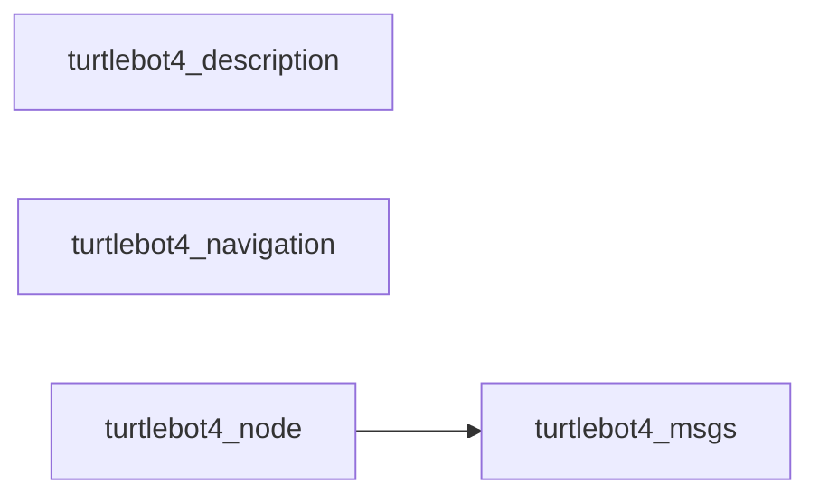
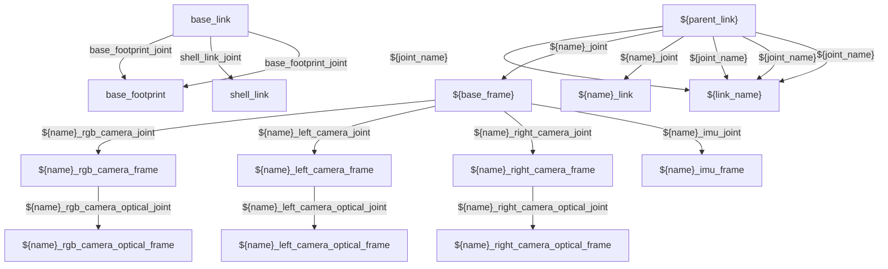

# turtlebot4 — Intermediate ROS 2 Overview

## Interpretation Rules

Static analysis detected 4 package(s), 4 launch file(s), 3 node declaration(s), and 19 resolved topic(s). In the graphs, rectangles are software/files and circles are communication channels. Solid launch edges are resolved local relationships; dashed edges are unresolved or external.

## Repository Structure

```text
turtlebot4/
  .DS_Store
  .github/CODEOWNERS
  .github/ISSUE_TEMPLATE/0-troubleshooting.yml
  .github/ISSUE_TEMPLATE/1-bug.yml
  .github/ISSUE_TEMPLATE/2-feature.yml
  .github/ISSUE_TEMPLATE/config.yml
  .github/PULL_REQUEST_TEMPLATE.md
  .github/workflows/ci.yml
  .gitignore
  LICENSE
  README.md
  turtlebot4_description/.DS_Store
  turtlebot4_description/CHANGELOG.rst
  turtlebot4_description/CMakeLists.txt
  turtlebot4_description/launch/robot_description.launch.py
  turtlebot4_description/meshes/camera_bracket.dae
  turtlebot4_description/meshes/oakd_lite.dae
  turtlebot4_description/meshes/oakd_pro.dae
  turtlebot4_description/meshes/rplidar.dae
  turtlebot4_description/meshes/shell.dae
  turtlebot4_description/meshes/shell_collision.dae
  turtlebot4_description/meshes/tower.dae
  turtlebot4_description/meshes/tower_sensor_plate.dae
  turtlebot4_description/meshes/tower_standoff.dae
  turtlebot4_description/meshes/weight_block.dae
  turtlebot4_description/package.xml
  turtlebot4_description/urdf/lite/turtlebot4.urdf.xacro
  turtlebot4_description/urdf/sensors/camera_bracket.urdf.xacro
  turtlebot4_description/urdf/sensors/oakd.urdf.xacro
  turtlebot4_description/urdf/sensors/rplidar.urdf.xacro
  turtlebot4_description/urdf/standard/tower_sensor_plate.urdf.xacro
  turtlebot4_description/urdf/standard/tower_standoff.urdf.xacro
  turtlebot4_description/urdf/standard/turtlebot4.urdf.xacro
  turtlebot4_description/urdf/standard/weight_block.urdf.xacro
  turtlebot4_msgs/CHANGELOG.rst
  turtlebot4_msgs/CMakeLists.txt
  turtlebot4_msgs/msg/UserButton.msg
  turtlebot4_msgs/msg/UserDisplay.msg
  turtlebot4_msgs/msg/UserLed.msg
  turtlebot4_msgs/package.xml
  turtlebot4_navigation/CHANGELOG.rst
  turtlebot4_navigation/CMakeLists.txt
  turtlebot4_navigation/config/localization.yaml
  turtlebot4_navigation/config/nav2.yaml
  turtlebot4_navigation/config/slam.yaml
  turtlebot4_navigation/launch/localization.launch.py
  turtlebot4_navigation/launch/nav2.launch.py
  turtlebot4_navigation/launch/slam.launch.py
  turtlebot4_navigation/maps/depot.pgm
  turtlebot4_navigation/maps/depot.yaml
  turtlebot4_navigation/maps/maze.pgm
  turtlebot4_navigation/maps/maze.yaml
  turtlebot4_navigation/maps/warehouse.pgm
  turtlebot4_navigation/maps/warehouse.yaml
  turtlebot4_navigation/package.xml
  turtlebot4_navigation/turtlebot4_navigation/__init__.py
  turtlebot4_navigation/turtlebot4_navigation/turtlebot4_navigator.py
  turtlebot4_node/CHANGELOG.rst
  turtlebot4_node/CMakeLists.txt
  turtlebot4_node/include/turtlebot4_node/action.hpp
  turtlebot4_node/include/turtlebot4_node/buttons.hpp
  turtlebot4_node/include/turtlebot4_node/display.hpp
  turtlebot4_node/include/turtlebot4_node/leds.hpp
  turtlebot4_node/include/turtlebot4_node/service.hpp
  turtlebot4_node/include/turtlebot4_node/turtlebot4.hpp
  turtlebot4_node/include/turtlebot4_node/utils.hpp
  turtlebot4_node/package.xml
  turtlebot4_node/src/buttons.cpp
  turtlebot4_node/src/display.cpp
  turtlebot4_node/src/leds.cpp
  turtlebot4_node/src/main.cpp
  turtlebot4_node/src/turtlebot4.cpp
```

## Packages And Dependencies



| Package | Path | Build type | Detected contents | Dependencies | Certainty |
| --- | --- | --- | --- | --- | --- |
| turtlebot4_description | turtlebot4_description | ament_cmake | 1 launch, 2 nodes | ament_cmake, ament_lint_auto, ament_lint_common, irobot_create_description, joint_state_publisher, robot_state_publisher, urdf | detected 100% |
| turtlebot4_msgs | turtlebot4_msgs | ament_cmake | 3 interfaces | ament_cmake, ament_lint_auto, ament_lint_common, rosidl_default_generators, rosidl_default_runtime, std_msgs | detected 100% |
| turtlebot4_navigation | turtlebot4_navigation | ament_cmake | 3 launch, 2 topics, 2 actions | ament_cmake, ament_cmake_python, ament_lint_auto, ament_lint_common, nav2_bringup, nav2_simple_commander, slam_toolbox | detected 100% |
| turtlebot4_node | turtlebot4_node | ament_cmake | 1 executables, 1 nodes, 18 topics, 6 services, 4 actions | ament_cmake, ament_lint_auto, ament_lint_common, irobot_create_msgs, rclcpp, rclcpp_action, rcutils, sensor_msgs | detected 100% |

## Launch Graph

```mermaid
flowchart TD
  launch_turtlebot4_description_launch_robot_description_launch_py["turtlebot4_description/launch/robot_description.launch.py"]
  launch_turtlebot4_description_launch_robot_description_launch_py --> action_turtlebot4_description_launch_robot_description_launch_py_0["robot_state_publisher/robot_state_publisher"]
  launch_turtlebot4_description_launch_robot_description_launch_py --> action_turtlebot4_description_launch_robot_description_launch_py_1["joint_state_publisher/joint_state_publisher"]
  launch_turtlebot4_navigation_launch_localization_launch_py["turtlebot4_navigation/launch/localization.launch.py"]
  launch_turtlebot4_navigation_launch_nav2_launch_py["turtlebot4_navigation/launch/nav2.launch.py"]
  launch_turtlebot4_navigation_launch_slam_launch_py["turtlebot4_navigation/launch/slam.launch.py"]
  launch_turtlebot4_navigation_launch_localization_launch_py -.-> include__find_pkg_share_nav2_bringup_launch_localization_launch_py0["$(find-pkg-share nav2_bringup)/launch/localization_launch.py"]
  launch_turtlebot4_navigation_launch_nav2_launch_py -.-> include__find_pkg_share_nav2_bringup_launch_navigation_launch_py1["$(find-pkg-share nav2_bringup)/launch/navigation_launch.py"]
  launch_turtlebot4_navigation_launch_slam_launch_py -.-> include__find_pkg_share_slam_toolbox_launch_online_sync_launch_py2["$(find-pkg-share slam_toolbox)/launch/online_sync_launch.py"]
  launch_turtlebot4_navigation_launch_slam_launch_py -.-> include__find_pkg_share_slam_toolbox_launch_online_async_launch_py3["$(find-pkg-share slam_toolbox)/launch/online_async_launch.py"]
```



| Owner | Launch file | Entry kind | Target | Arguments/modifiers | Certainty |
| --- | --- | --- | --- | --- | --- |
| turtlebot4_description | turtlebot4_description/launch/robot_description.launch.py | launch file | python |  | detected 100% |
| turtlebot4_description | turtlebot4_description/launch/robot_description.launch.py | node | robot_state_publisher/robot_state_publisher | 2 remap(s), 2 parameter source(s) | detected 100% |
| turtlebot4_description | turtlebot4_description/launch/robot_description.launch.py | node | joint_state_publisher/joint_state_publisher | 2 remap(s), 1 parameter source(s) | detected 100% |
| turtlebot4_navigation | turtlebot4_navigation/launch/localization.launch.py | launch file | python |  | detected 100% |
| turtlebot4_navigation | turtlebot4_navigation/launch/localization.launch.py | namespace | $(var namespace) |  | detected 92% |
| turtlebot4_navigation | turtlebot4_navigation/launch/localization.launch.py | include | $(find-pkg-share nav2_bringup)/launch/localization_launch.py | {'namespace': namespace, 'map': LaunchConfiguration('map'), 'use_sim_time': use_sim_time, 'params_file': LaunchConfiguration('params')}.items() | detected 92% |
| turtlebot4_navigation | turtlebot4_navigation/launch/nav2.launch.py | launch file | python |  | detected 100% |
| turtlebot4_navigation | turtlebot4_navigation/launch/nav2.launch.py | namespace | $(var namespace) |  | detected 92% |
| turtlebot4_navigation | turtlebot4_navigation/launch/nav2.launch.py | remap | /namespace.perform(context)/global_costmap/scan |  | detected 85% |
| turtlebot4_navigation | turtlebot4_navigation/launch/nav2.launch.py | remap | /namespace.perform(context)/local_costmap/scan |  | detected 85% |
| turtlebot4_navigation | turtlebot4_navigation/launch/nav2.launch.py | include | $(find-pkg-share nav2_bringup)/launch/navigation_launch.py | [('use_sim_time', use_sim_time), ('params_file', nav2_params.perform(context)), ('use_composition', 'False'), ('namespace', namespace_str)] | detected 92% |
| turtlebot4_navigation | turtlebot4_navigation/launch/slam.launch.py | launch file | python |  | detected 100% |
| turtlebot4_navigation | turtlebot4_navigation/launch/slam.launch.py | namespace | $(var namespace) |  | detected 92% |
| turtlebot4_navigation | turtlebot4_navigation/launch/slam.launch.py | remap | /tf |  | detected 100% |
| turtlebot4_navigation | turtlebot4_navigation/launch/slam.launch.py | remap | /tf_static |  | detected 100% |
| turtlebot4_navigation | turtlebot4_navigation/launch/slam.launch.py | include | $(find-pkg-share slam_toolbox)/launch/online_sync_launch.py | [('use_sim_time', use_sim_time), ('autostart', autostart), ('use_lifecycle_manager', use_lifecycle_manager), ('slam_params_file', rewritten_slam_params)] | detected 92% |
| turtlebot4_navigation | turtlebot4_navigation/launch/slam.launch.py | include | $(find-pkg-share slam_toolbox)/launch/online_async_launch.py | [('use_sim_time', use_sim_time), ('autostart', autostart), ('use_lifecycle_manager', use_lifecycle_manager), ('slam_params_file', rewritten_slam_params)] | detected 92% |

## Topic Graph

```mermaid
flowchart LR
  topic_battery_state(("battery_state"))
  topic_battery_state --> sub_battery_state_turtlebot4_node_0["turtlebot4_node subscriber"]
  topic_dock_status(("dock_status"))
  topic_dock_status --> sub_dock_status_turtlebot4_navigation_0["turtlebot4_navigation subscriber"]
  topic_dock_status --> sub_dock_status_turtlebot4_node_1["turtlebot4_node subscriber"]
  topic_function_calls(("function_calls"))
  pub_function_calls_turtlebot4_node_0["turtlebot4_node publisher"] --> topic_function_calls
  topic_hmi_buttons(("hmi/buttons"))
  topic_hmi_buttons --> sub_hmi_buttons_turtlebot4_node_0["turtlebot4_node subscriber"]
  topic_hmi_display(("hmi/display"))
  pub_hmi_display_turtlebot4_node_0["turtlebot4_node publisher"] --> topic_hmi_display
  topic_hmi_display_message(("hmi/display/message"))
  topic_hmi_display_message --> sub_hmi_display_message_turtlebot4_node_0["turtlebot4_node subscriber"]
  topic_hmi_led(("hmi/led"))
  topic_hmi_led --> sub_hmi_led_turtlebot4_node_0["turtlebot4_node subscriber"]
  topic_hmi_led__battery(("hmi/led/_battery"))
  pub_hmi_led__battery_turtlebot4_node_0["turtlebot4_node publisher"] --> topic_hmi_led__battery
  topic_hmi_led__comms(("hmi/led/_comms"))
  pub_hmi_led__comms_turtlebot4_node_0["turtlebot4_node publisher"] --> topic_hmi_led__comms
  topic_hmi_led__motors(("hmi/led/_motors"))
  pub_hmi_led__motors_turtlebot4_node_0["turtlebot4_node publisher"] --> topic_hmi_led__motors
  topic_hmi_led__power(("hmi/led/_power"))
  pub_hmi_led__power_turtlebot4_node_0["turtlebot4_node publisher"] --> topic_hmi_led__power
  topic_hmi_led__user1(("hmi/led/_user1"))
  pub_hmi_led__user1_turtlebot4_node_0["turtlebot4_node publisher"] --> topic_hmi_led__user1
  topic_hmi_led__user2(("hmi/led/_user2"))
  pub_hmi_led__user2_turtlebot4_node_0["turtlebot4_node publisher"] --> topic_hmi_led__user2
  topic_hmi_led__wifi(("hmi/led/_wifi"))
  pub_hmi_led__wifi_turtlebot4_node_0["turtlebot4_node publisher"] --> topic_hmi_led__wifi
  topic_initialpose(("initialpose"))
  topic_initialpose --> sub_initialpose_turtlebot4_navigation_0["turtlebot4_navigation subscriber"]
  topic_interface_buttons(("interface_buttons"))
  topic_interface_buttons --> sub_interface_buttons_turtlebot4_node_0["turtlebot4_node subscriber"]
```



## Node-Level Runtime Graph

```mermaid
flowchart LR
  source_turtlebot4_navigation_unresolved_turtlebot4_navigation_turtlebot4_navigation_turtlebot4_navigator_py["/unresolved\nturtlebot4_navigation"]
  topic_dock_status(("dock_status"))
  topic_dock_status --> source_turtlebot4_navigation_unresolved_turtlebot4_navigation_turtlebot4_navigation_turtlebot4_navigator_py
  topic_initialpose(("initialpose"))
  topic_initialpose --> source_turtlebot4_navigation_unresolved_turtlebot4_navigation_turtlebot4_navigation_turtlebot4_navigator_py
  action_undock[["undock"]]
  source_turtlebot4_navigation_unresolved_turtlebot4_navigation_turtlebot4_navigation_turtlebot4_navigator_py --> action_undock
  action_dock[["dock"]]
  source_turtlebot4_navigation_unresolved_turtlebot4_navigation_turtlebot4_navigation_turtlebot4_navigator_py --> action_dock
  source_turtlebot4_node_turtlebot4_node_turtlebot4_node_src_turtlebot4_cpp["/turtlebot4_node\nturtlebot4_node"]
  topic_hmi_display(("hmi/display"))
  source_turtlebot4_node_turtlebot4_node_turtlebot4_node_src_turtlebot4_cpp --> topic_hmi_display
  topic_hmi_led__power(("hmi/led/_power"))
  source_turtlebot4_node_turtlebot4_node_turtlebot4_node_src_turtlebot4_cpp --> topic_hmi_led__power
  topic_hmi_led__motors(("hmi/led/_motors"))
  source_turtlebot4_node_turtlebot4_node_turtlebot4_node_src_turtlebot4_cpp --> topic_hmi_led__motors
  topic_hmi_led__comms(("hmi/led/_comms"))
  source_turtlebot4_node_turtlebot4_node_turtlebot4_node_src_turtlebot4_cpp --> topic_hmi_led__comms
  topic_hmi_led__wifi(("hmi/led/_wifi"))
  source_turtlebot4_node_turtlebot4_node_turtlebot4_node_src_turtlebot4_cpp --> topic_hmi_led__wifi
  topic_hmi_led__battery(("hmi/led/_battery"))
  source_turtlebot4_node_turtlebot4_node_turtlebot4_node_src_turtlebot4_cpp --> topic_hmi_led__battery
  topic_hmi_led__user1(("hmi/led/_user1"))
  source_turtlebot4_node_turtlebot4_node_turtlebot4_node_src_turtlebot4_cpp --> topic_hmi_led__user1
  topic_hmi_led__user2(("hmi/led/_user2"))
  source_turtlebot4_node_turtlebot4_node_turtlebot4_node_src_turtlebot4_cpp --> topic_hmi_led__user2
  topic_ip(("ip"))
  source_turtlebot4_node_turtlebot4_node_turtlebot4_node_src_turtlebot4_cpp --> topic_ip
  topic_function_calls(("function_calls"))
  source_turtlebot4_node_turtlebot4_node_turtlebot4_node_src_turtlebot4_cpp --> topic_function_calls
  topic_interface_buttons(("interface_buttons"))
  topic_interface_buttons --> source_turtlebot4_node_turtlebot4_node_turtlebot4_node_src_turtlebot4_cpp
  topic_joy(("joy"))
  topic_joy --> source_turtlebot4_node_turtlebot4_node_turtlebot4_node_src_turtlebot4_cpp
  topic_hmi_buttons(("hmi/buttons"))
  topic_hmi_buttons --> source_turtlebot4_node_turtlebot4_node_turtlebot4_node_src_turtlebot4_cpp
  topic_hmi_display_message(("hmi/display/message"))
  topic_hmi_display_message --> source_turtlebot4_node_turtlebot4_node_turtlebot4_node_src_turtlebot4_cpp
  topic_hmi_led(("hmi/led"))
  topic_hmi_led --> source_turtlebot4_node_turtlebot4_node_turtlebot4_node_src_turtlebot4_cpp
  topic_battery_state(("battery_state"))
  topic_battery_state --> source_turtlebot4_node_turtlebot4_node_turtlebot4_node_src_turtlebot4_cpp
  topic_dock_status(("dock_status"))
  topic_dock_status --> source_turtlebot4_node_turtlebot4_node_turtlebot4_node_src_turtlebot4_cpp
  topic_wheel_status(("wheel_status"))
  topic_wheel_status --> source_turtlebot4_node_turtlebot4_node_turtlebot4_node_src_turtlebot4_cpp
  service_e_stop{{"e_stop"}}
  source_turtlebot4_node_turtlebot4_node_turtlebot4_node_src_turtlebot4_cpp --> service_e_stop
  service_robot_power{{"robot_power"}}
  source_turtlebot4_node_turtlebot4_node_turtlebot4_node_src_turtlebot4_cpp --> service_robot_power
  service_start_motor{{"start_motor"}}
  source_turtlebot4_node_turtlebot4_node_turtlebot4_node_src_turtlebot4_cpp --> service_start_motor
  service_stop_motor{{"stop_motor"}}
  source_turtlebot4_node_turtlebot4_node_turtlebot4_node_src_turtlebot4_cpp --> service_stop_motor
  service_oakd_start_camera{{"oakd/start_camera"}}
  source_turtlebot4_node_turtlebot4_node_turtlebot4_node_src_turtlebot4_cpp --> service_oakd_start_camera
  service_oakd_stop_camera{{"oakd/stop_camera"}}
  source_turtlebot4_node_turtlebot4_node_turtlebot4_node_src_turtlebot4_cpp --> service_oakd_stop_camera
  action_dock[["dock"]]
  source_turtlebot4_node_turtlebot4_node_turtlebot4_node_src_turtlebot4_cpp --> action_dock
  action_undock[["undock"]]
  source_turtlebot4_node_turtlebot4_node_turtlebot4_node_src_turtlebot4_cpp --> action_undock
  action_wall_follow[["wall_follow"]]
  source_turtlebot4_node_turtlebot4_node_turtlebot4_node_src_turtlebot4_cpp --> action_wall_follow
  action_led_animation[["led_animation"]]
  source_turtlebot4_node_turtlebot4_node_turtlebot4_node_src_turtlebot4_cpp --> action_led_animation
  launch_turtlebot4_description_launch_robot_description_launch_py_0_robot_state_publisher["/robot_state_publisher\nrobot_state_publisher"]
  launch_turtlebot4_description_launch_robot_description_launch_py_1_joint_state_publisher["/joint_state_publisher\njoint_state_publisher"]
```



| Package | Node | Namespace | Executable | Origin | Active | Interfaces | Effective parameters | Certainty |
| --- | --- | --- | --- | --- | --- | --- | --- | --- |
| turtlebot4_navigation | <unresolved> |  |  | source_scope | yes | 4 | 0 | inferred 58% |
| turtlebot4_node | turtlebot4_node |  | turtlebot4_node | source | yes | 28 | 5 | detected 100% |
| robot_state_publisher | robot_state_publisher |  | robot_state_publisher | launch | yes | 0 | 2 | detected 100% |
| joint_state_publisher | joint_state_publisher |  | joint_state_publisher | launch | yes | 0 | 1 | detected 100% |

### Publishers

| Package | Topic | Message type | QoS | Location | Certainty |
| --- | --- | --- | --- | --- | --- |
| turtlebot4_node | hmi/display | turtlebot4_msgs/msg/UserDisplay | expression=rclcpp::SensorDataQoS() | turtlebot4_node/src/display.cpp:48 | detected 100% |
| turtlebot4_node | hmi/led/_power | std_msgs/msg/Int32 |  | turtlebot4_node/src/leds.cpp:47 | detected 90% |
| turtlebot4_node | hmi/led/_motors | std_msgs/msg/Int32 |  | turtlebot4_node/src/leds.cpp:48 | detected 90% |
| turtlebot4_node | hmi/led/_comms | std_msgs/msg/Int32 |  | turtlebot4_node/src/leds.cpp:49 | detected 90% |
| turtlebot4_node | hmi/led/_wifi | std_msgs/msg/Int32 |  | turtlebot4_node/src/leds.cpp:50 | detected 90% |
| turtlebot4_node | hmi/led/_battery | std_msgs/msg/Int32 |  | turtlebot4_node/src/leds.cpp:51 | detected 90% |
| turtlebot4_node | hmi/led/_user1 | std_msgs/msg/Int32 |  | turtlebot4_node/src/leds.cpp:52 | detected 90% |
| turtlebot4_node | hmi/led/_user2 | std_msgs/msg/Int32 |  | turtlebot4_node/src/leds.cpp:53 | detected 90% |
| turtlebot4_node | ip | std_msgs/msg/String | expression=rclcpp::QoS(rclcpp::KeepLast(10)) | turtlebot4_node/src/turtlebot4.cpp:149 | detected 100% |
| turtlebot4_node | function_calls | std_msgs/msg/String | expression=rclcpp::QoS(rclcpp::KeepLast(10)) | turtlebot4_node/src/turtlebot4.cpp:153 | detected 100% |

### Subscribers

| Package | Topic | Message type | QoS | Location | Certainty |
| --- | --- | --- | --- | --- | --- |
| turtlebot4_navigation | dock_status | irobot_create_msgs/msg/DockStatus | expression=qos_profile_sensor_data, dynamic=yes | turtlebot4_navigation/turtlebot4_navigation/turtlebot4_navigator.py:58 | detected 100% |
| turtlebot4_navigation | initialpose | geometry_msgs/msg/PoseWithCovarianceStamped | expression=qos_profile_system_default, dynamic=yes | turtlebot4_navigation/turtlebot4_navigation/turtlebot4_navigator.py:63 | detected 100% |
| turtlebot4_node | interface_buttons | irobot_create_msgs/msg/InterfaceButtons | expression=rclcpp::SensorDataQoS() | turtlebot4_node/src/buttons.cpp:37 | detected 100% |
| turtlebot4_node | joy | sensor_msgs/msg/Joy | expression=rclcpp::QoS(10), depth=10 | turtlebot4_node/src/buttons.cpp:42 | detected 100% |
| turtlebot4_node | hmi/buttons | turtlebot4_msgs/msg/UserButton | expression=rclcpp::SensorDataQoS() | turtlebot4_node/src/buttons.cpp:48 | detected 100% |
| turtlebot4_node | hmi/display/message | std_msgs/msg/String | expression=rclcpp::SensorDataQoS() | turtlebot4_node/src/display.cpp:51 | detected 100% |
| turtlebot4_node | hmi/led | turtlebot4_msgs/msg/UserLed | expression=rclcpp::SensorDataQoS() | turtlebot4_node/src/leds.cpp:42 | detected 100% |
| turtlebot4_node | battery_state | sensor_msgs/msg/BatteryState | expression=rclcpp::SensorDataQoS() | turtlebot4_node/src/turtlebot4.cpp:133 | detected 100% |
| turtlebot4_node | dock_status | irobot_create_msgs/msg/DockStatus | expression=rclcpp::SensorDataQoS() | turtlebot4_node/src/turtlebot4.cpp:138 | detected 100% |
| turtlebot4_node | wheel_status | irobot_create_msgs/msg/WheelStatus | expression=rclcpp::SensorDataQoS() | turtlebot4_node/src/turtlebot4.cpp:143 | detected 100% |

## Services And Actions

### Service Servers

_None detected._

### Service Clients

| Package | Service | Type | Location | Certainty |
| --- | --- | --- | --- | --- |
| turtlebot4_node | e_stop | irobot_create_msgs/srv/EStop | turtlebot4_node/src/turtlebot4.cpp:164 | detected 94% |
| turtlebot4_node | robot_power | irobot_create_msgs/srv/RobotPower | turtlebot4_node/src/turtlebot4.cpp:165 | detected 94% |
| turtlebot4_node | start_motor | std_srvs/srv/Empty | turtlebot4_node/src/turtlebot4.cpp:166 | detected 94% |
| turtlebot4_node | stop_motor | std_srvs/srv/Empty | turtlebot4_node/src/turtlebot4.cpp:169 | detected 94% |
| turtlebot4_node | oakd/start_camera | std_srvs/srv/Trigger | turtlebot4_node/src/turtlebot4.cpp:172 | detected 94% |
| turtlebot4_node | oakd/stop_camera | std_srvs/srv/Trigger | turtlebot4_node/src/turtlebot4.cpp:175 | detected 94% |

### Action Servers

_None detected._

### Action Clients

| Package | Action | Type | Location | Certainty |
| --- | --- | --- | --- | --- |
| turtlebot4_navigation | undock | irobot_create_msgs/action/Undock | turtlebot4_navigation/turtlebot4_navigation/turtlebot4_navigator.py:68 | detected 100% |
| turtlebot4_navigation | dock | irobot_create_msgs/action/Dock | turtlebot4_navigation/turtlebot4_navigation/turtlebot4_navigator.py:69 | detected 100% |
| turtlebot4_node | dock | irobot_create_msgs/action/Dock | turtlebot4_node/src/turtlebot4.cpp:158 | detected 94% |
| turtlebot4_node | undock | irobot_create_msgs/action/Undock | turtlebot4_node/src/turtlebot4.cpp:159 | detected 94% |
| turtlebot4_node | wall_follow | irobot_create_msgs/action/WallFollow | turtlebot4_node/src/turtlebot4.cpp:160 | detected 94% |
| turtlebot4_node | led_animation | irobot_create_msgs/action/LedAnimation | turtlebot4_node/src/turtlebot4.cpp:161 | detected 94% |

### Resolved Service Graph

| Service | Types | Servers | Clients | Certainty |
| --- | --- | --- | --- | --- |
| e_stop | irobot_create_msgs/srv/EStop |  | turtlebot4_node | detected 94% |
| oakd/start_camera | std_srvs/srv/Trigger |  | turtlebot4_node | detected 94% |
| oakd/stop_camera | std_srvs/srv/Trigger |  | turtlebot4_node | detected 94% |
| robot_power | irobot_create_msgs/srv/RobotPower |  | turtlebot4_node | detected 94% |
| start_motor | std_srvs/srv/Empty |  | turtlebot4_node | detected 94% |
| stop_motor | std_srvs/srv/Empty |  | turtlebot4_node | detected 94% |

### Resolved Action Graph

| Action | Types | Servers | Clients | Certainty |
| --- | --- | --- | --- | --- |
| dock | irobot_create_msgs/action/Dock |  | source:turtlebot4_navigation:unresolved:turtlebot4_navigation/turtlebot4_navigation/turtlebot4_navigator.py, turtlebot4_node | detected 94% |
| led_animation | irobot_create_msgs/action/LedAnimation |  | turtlebot4_node | detected 94% |
| undock | irobot_create_msgs/action/Undock |  | source:turtlebot4_navigation:unresolved:turtlebot4_navigation/turtlebot4_navigation/turtlebot4_navigator.py, turtlebot4_node | detected 94% |
| wall_follow | irobot_create_msgs/action/WallFollow |  | turtlebot4_node | detected 94% |

## Robot Structure And TF



## Sensors, Algorithms, And Actuation

| Package | Sensor/input | Type | Role | Location | Certainty |
| --- | --- | --- | --- | --- | --- |
|  | rgbd_camera | rgbd_camera |  | turtlebot4_description/urdf/sensors/oakd.urdf.xacro:124 | detected 96% |
| turtlebot4_node | battery_state | sensor_msgs/msg/BatteryState | sensor data interface | turtlebot4_node/src/turtlebot4.cpp:133 | inferred 78% |

| Package | Plugin/component | Detected type | Inferred role | Location | Certainty |
| --- | --- | --- | --- | --- | --- |
| turtlebot4_navigation | nav2_bt_navigator::NavigateToPoseNavigator | runtime plugin | runtime plugin | turtlebot4_navigation/config/nav2.yaml:13 | inferred 78% |
| turtlebot4_navigation | nav2_bt_navigator::NavigateThroughPosesNavigator | runtime plugin | runtime plugin | turtlebot4_navigation/config/nav2.yaml:15 | inferred 78% |
| turtlebot4_navigation | nav2_controller::SimpleProgressChecker | control | control | turtlebot4_navigation/config/nav2.yaml:33 | inferred 78% |
| turtlebot4_navigation | nav2_controller::SimpleGoalChecker | control | control | turtlebot4_navigation/config/nav2.yaml:38 | inferred 78% |
| turtlebot4_navigation | nav2_mppi_controller::MPPIController | control | control | turtlebot4_navigation/config/nav2.yaml:42 | inferred 78% |
| turtlebot4_navigation | nav2_costmap_2d::InflationLayer | environment model | environment model | turtlebot4_navigation/config/nav2.yaml:148 | inferred 78% |
| turtlebot4_navigation | nav2_costmap_2d::VoxelLayer | environment model | environment model | turtlebot4_navigation/config/nav2.yaml:152 | inferred 78% |
| turtlebot4_navigation | nav2_costmap_2d::StaticLayer | environment model | environment model | turtlebot4_navigation/config/nav2.yaml:172 | inferred 78% |
| turtlebot4_navigation | nav2_costmap_2d::ObstacleLayer | environment model | environment model | turtlebot4_navigation/config/nav2.yaml:196 | inferred 78% |
| turtlebot4_navigation | nav2_costmap_2d::StaticLayer | environment model | environment model | turtlebot4_navigation/config/nav2.yaml:210 | inferred 78% |
| turtlebot4_navigation | nav2_costmap_2d::InflationLayer | environment model | environment model | turtlebot4_navigation/config/nav2.yaml:213 | inferred 78% |
| turtlebot4_navigation | nav2_navfn_planner::NavfnPlanner | planning | planning | turtlebot4_navigation/config/nav2.yaml:224 | inferred 78% |
| turtlebot4_navigation | nav2_smoother::SimpleSmoother | runtime plugin | runtime plugin | turtlebot4_navigation/config/nav2.yaml:234 | inferred 78% |
| turtlebot4_navigation | nav2_behaviors::Spin | behavior execution | behavior execution | turtlebot4_navigation/config/nav2.yaml:249 | inferred 78% |
| turtlebot4_navigation | nav2_behaviors::BackUp | behavior execution | behavior execution | turtlebot4_navigation/config/nav2.yaml:251 | inferred 78% |
| turtlebot4_navigation | nav2_behaviors::DriveOnHeading | behavior execution | behavior execution | turtlebot4_navigation/config/nav2.yaml:253 | inferred 78% |
| turtlebot4_navigation | nav2_behaviors::Wait | behavior execution | behavior execution | turtlebot4_navigation/config/nav2.yaml:255 | inferred 78% |
| turtlebot4_navigation | nav2_behaviors::AssistedTeleop | behavior execution | behavior execution | turtlebot4_navigation/config/nav2.yaml:257 | inferred 78% |
| turtlebot4_navigation | nav2_waypoint_follower::WaitAtWaypoint | runtime plugin | runtime plugin | turtlebot4_navigation/config/nav2.yaml:275 | inferred 78% |
| turtlebot4_navigation | opennav_docking::SimpleChargingDock | docking | docking | turtlebot4_navigation/config/nav2.yaml:344 | inferred 78% |

| Package | Command interface | Type | Role | Location | Certainty |
| --- | --- | --- | --- | --- | --- |
| turtlebot4_node | hmi/led/_motors | std_msgs/msg/Int32 | command or actuation interface | turtlebot4_node/src/leds.cpp:48 | inferred 75% |
| turtlebot4_node | start_motor | std_srvs/srv/Empty | command or actuation interface | turtlebot4_node/src/turtlebot4.cpp:166 | inferred 75% |
| turtlebot4_node | stop_motor | std_srvs/srv/Empty | command or actuation interface | turtlebot4_node/src/turtlebot4.cpp:169 | inferred 75% |

## Custom Interfaces

| Package | Kind | Name | File | Certainty |
| --- | --- | --- | --- | --- |
| turtlebot4_msgs | message | UserButton | turtlebot4_msgs/msg/UserButton.msg | detected 100% |
| turtlebot4_msgs | message | UserDisplay | turtlebot4_msgs/msg/UserDisplay.msg | detected 100% |
| turtlebot4_msgs | message | UserLed | turtlebot4_msgs/msg/UserLed.msg | detected 100% |

## Modification Guide

| Task | Package | Path | Why this path | Certainty | Evidence |
| --- | --- | --- | --- | --- | --- |
| Change startup, composition, namespaces, or remappings | turtlebot4_description | turtlebot4_description/launch/robot_description.launch.py | launch entry point detected | inferred 85% | turtlebot4_description/launch/robot_description.launch.py:1 (launch_classifier) |
| Change robot geometry, joints, sensors, or frame structure | turtlebot4_description | turtlebot4_description/urdf/lite/turtlebot4.urdf.xacro | URDF/Xacro model detected | inferred 90% | turtlebot4_description/urdf/lite/turtlebot4.urdf.xacro:1 (path_classifier) |
| Change a ROS message, service, or action contract | turtlebot4_msgs | turtlebot4_msgs/msg/UserButton.msg | custom interface detected | inferred 90% | turtlebot4_msgs/msg/UserButton.msg:1 (ros_interface_parser) |
| Change startup, composition, namespaces, or remappings | turtlebot4_navigation | turtlebot4_navigation/launch/localization.launch.py | launch entry point detected | inferred 85% | turtlebot4_navigation/launch/localization.launch.py:1 (launch_classifier) |
| Tune runtime behavior and algorithm settings | turtlebot4_navigation | turtlebot4_navigation/config/localization.yaml | ROS parameter file detected | inferred 82% | turtlebot4_navigation/config/localization.yaml:1 (yaml_parameter_tree) |
| Change node behavior or ROS communication | turtlebot4_navigation | turtlebot4_navigation/turtlebot4_navigation/turtlebot4_navigator.py | source file contains ROS entities | inferred 80% | turtlebot4_navigation/turtlebot4_navigation/turtlebot4_navigator.py:58 (python_ast) |
| Change node behavior or ROS communication | turtlebot4_node | turtlebot4_node/src/turtlebot4.cpp | source file contains ROS entities | inferred 80% | turtlebot4_node/src/turtlebot4.cpp:149 (cpp_call_parser) |

## Diagnostics

| Severity | Code | Finding | Meaning | Recommended repair | Verification commands | Certainty | Evidence |
| --- | --- | --- | --- | --- | --- | --- | --- |
| info | RD101 | Possible undeclared dependency | turtlebot4_navigation references 'action_msgs' but package.xml does not declare it. This reference is indirect and may be a namespace, test-only import, or transitive dependency. | Declare the referenced ROS package dependency or suppress the finding if it is intentionally external. | rosdep check --from-paths src --ignore-src | diagnostic 58% | turtlebot4_navigation/turtlebot4_navigation/turtlebot4_navigator.py:1 (python_import) |
| info | RD101 | Possible undeclared dependency | turtlebot4_navigation references 'geometry_msgs' but package.xml does not declare it. This reference is indirect and may be a namespace, test-only import, or transitive dependency. | Declare the referenced ROS package dependency or suppress the finding if it is intentionally external. | rosdep check --from-paths src --ignore-src | diagnostic 58% | turtlebot4_navigation/turtlebot4_navigation/turtlebot4_navigator.py:1 (python_import) |
| info | RD101 | Possible undeclared dependency | turtlebot4_navigation references 'irobot_create_msgs' but package.xml does not declare it. This reference is indirect and may be a namespace, test-only import, or transitive dependency. | Declare the referenced ROS package dependency or suppress the finding if it is intentionally external. | rosdep check --from-paths src --ignore-src | diagnostic 58% | turtlebot4_navigation/turtlebot4_navigation/turtlebot4_navigator.py:1 (python_import) |
| info | RD101 | Possible undeclared dependency | turtlebot4_navigation references 'rclpy' but package.xml does not declare it. This reference is indirect and may be a namespace, test-only import, or transitive dependency. | Declare the referenced ROS package dependency or suppress the finding if it is intentionally external. | rosdep check --from-paths src --ignore-src | diagnostic 58% | turtlebot4_navigation/turtlebot4_navigation/turtlebot4_navigator.py:1 (python_import) |
| info | RD202 | Orphan topic endpoint | Topic 'battery_state' has no statically detected publisher. Runtime or external nodes may provide it. | Launch or implement the missing topic endpoint, or suppress this code when the endpoint is external. | ros2 topic list, ros2 topic info battery_state --verbose | diagnostic 62% | turtlebot4_node/src/turtlebot4.cpp:133 (cpp_call_parser) |
| info | RD202 | Orphan topic endpoint | Topic 'dock_status' has no statically detected publisher. Runtime or external nodes may provide it. | Launch or implement the missing topic endpoint, or suppress this code when the endpoint is external. | ros2 topic list, ros2 topic info dock_status --verbose | diagnostic 62% | turtlebot4_navigation/turtlebot4_navigation/turtlebot4_navigator.py:58 (python_ast) |
| info | RD202 | Orphan topic endpoint | Topic 'function_calls' has no statically detected subscriber. Runtime or external nodes may provide it. | Launch or implement the missing topic endpoint, or suppress this code when the endpoint is external. | ros2 topic list, ros2 topic info function_calls --verbose | diagnostic 62% | turtlebot4_node/src/turtlebot4.cpp:153 (cpp_call_parser) |
| info | RD202 | Orphan topic endpoint | Topic 'hmi/buttons' has no statically detected publisher. Runtime or external nodes may provide it. | Launch or implement the missing topic endpoint, or suppress this code when the endpoint is external. | ros2 topic list, ros2 topic info hmi/buttons --verbose | diagnostic 62% | turtlebot4_node/src/buttons.cpp:48 (cpp_call_parser) |
| info | RD202 | Orphan topic endpoint | Topic 'hmi/display' has no statically detected subscriber. Runtime or external nodes may provide it. | Launch or implement the missing topic endpoint, or suppress this code when the endpoint is external. | ros2 topic list, ros2 topic info hmi/display --verbose | diagnostic 62% | turtlebot4_node/src/display.cpp:48 (cpp_call_parser) |
| info | RD202 | Orphan topic endpoint | Topic 'hmi/display/message' has no statically detected publisher. Runtime or external nodes may provide it. | Launch or implement the missing topic endpoint, or suppress this code when the endpoint is external. | ros2 topic list, ros2 topic info hmi/display/message --verbose | diagnostic 62% | turtlebot4_node/src/display.cpp:51 (cpp_call_parser) |
| info | RD202 | Orphan topic endpoint | Topic 'hmi/led' has no statically detected publisher. Runtime or external nodes may provide it. | Launch or implement the missing topic endpoint, or suppress this code when the endpoint is external. | ros2 topic list, ros2 topic info hmi/led --verbose | diagnostic 62% | turtlebot4_node/src/leds.cpp:42 (cpp_call_parser) |
| info | RD202 | Orphan topic endpoint | Topic 'hmi/led/_battery' has no statically detected subscriber. Runtime or external nodes may provide it. | Launch or implement the missing topic endpoint, or suppress this code when the endpoint is external. | ros2 topic list, ros2 topic info hmi/led/_battery --verbose | diagnostic 62% | turtlebot4_node/src/leds.cpp:51 (cpp_method_wrapper_resolution) |
| info | RD202 | Orphan topic endpoint | Topic 'hmi/led/_comms' has no statically detected subscriber. Runtime or external nodes may provide it. | Launch or implement the missing topic endpoint, or suppress this code when the endpoint is external. | ros2 topic list, ros2 topic info hmi/led/_comms --verbose | diagnostic 62% | turtlebot4_node/src/leds.cpp:49 (cpp_method_wrapper_resolution) |
| info | RD202 | Orphan topic endpoint | Topic 'hmi/led/_motors' has no statically detected subscriber. Runtime or external nodes may provide it. | Launch or implement the missing topic endpoint, or suppress this code when the endpoint is external. | ros2 topic list, ros2 topic info hmi/led/_motors --verbose | diagnostic 62% | turtlebot4_node/src/leds.cpp:48 (cpp_method_wrapper_resolution) |
| info | RD202 | Orphan topic endpoint | Topic 'hmi/led/_power' has no statically detected subscriber. Runtime or external nodes may provide it. | Launch or implement the missing topic endpoint, or suppress this code when the endpoint is external. | ros2 topic list, ros2 topic info hmi/led/_power --verbose | diagnostic 62% | turtlebot4_node/src/leds.cpp:47 (cpp_method_wrapper_resolution) |
| info | RD202 | Orphan topic endpoint | Topic 'hmi/led/_user1' has no statically detected subscriber. Runtime or external nodes may provide it. | Launch or implement the missing topic endpoint, or suppress this code when the endpoint is external. | ros2 topic list, ros2 topic info hmi/led/_user1 --verbose | diagnostic 62% | turtlebot4_node/src/leds.cpp:52 (cpp_method_wrapper_resolution) |
| info | RD202 | Orphan topic endpoint | Topic 'hmi/led/_user2' has no statically detected subscriber. Runtime or external nodes may provide it. | Launch or implement the missing topic endpoint, or suppress this code when the endpoint is external. | ros2 topic list, ros2 topic info hmi/led/_user2 --verbose | diagnostic 62% | turtlebot4_node/src/leds.cpp:53 (cpp_method_wrapper_resolution) |
| info | RD202 | Orphan topic endpoint | Topic 'hmi/led/_wifi' has no statically detected subscriber. Runtime or external nodes may provide it. | Launch or implement the missing topic endpoint, or suppress this code when the endpoint is external. | ros2 topic list, ros2 topic info hmi/led/_wifi --verbose | diagnostic 62% | turtlebot4_node/src/leds.cpp:50 (cpp_method_wrapper_resolution) |
| info | RD202 | Orphan topic endpoint | Topic 'initialpose' has no statically detected publisher. Runtime or external nodes may provide it. | Launch or implement the missing topic endpoint, or suppress this code when the endpoint is external. | ros2 topic list, ros2 topic info initialpose --verbose | diagnostic 62% | turtlebot4_navigation/turtlebot4_navigation/turtlebot4_navigator.py:63 (python_ast) |
| info | RD202 | Orphan topic endpoint | Topic 'interface_buttons' has no statically detected publisher. Runtime or external nodes may provide it. | Launch or implement the missing topic endpoint, or suppress this code when the endpoint is external. | ros2 topic list, ros2 topic info interface_buttons --verbose | diagnostic 62% | turtlebot4_node/src/buttons.cpp:37 (cpp_call_parser) |
| info | RD202 | Orphan topic endpoint | Topic 'ip' has no statically detected subscriber. Runtime or external nodes may provide it. | Launch or implement the missing topic endpoint, or suppress this code when the endpoint is external. | ros2 topic list, ros2 topic info ip --verbose | diagnostic 62% | turtlebot4_node/src/turtlebot4.cpp:149 (cpp_call_parser) |
| info | RD202 | Orphan topic endpoint | Topic 'joy' has no statically detected publisher. Runtime or external nodes may provide it. | Launch or implement the missing topic endpoint, or suppress this code when the endpoint is external. | ros2 topic list, ros2 topic info joy --verbose | diagnostic 62% | turtlebot4_node/src/buttons.cpp:42 (cpp_call_parser) |
| info | RD202 | Orphan topic endpoint | Topic 'wheel_status' has no statically detected publisher. Runtime or external nodes may provide it. | Launch or implement the missing topic endpoint, or suppress this code when the endpoint is external. | ros2 topic list, ros2 topic info wheel_status --verbose | diagnostic 62% | turtlebot4_node/src/turtlebot4.cpp:143 (cpp_call_parser) |
| info | RD205 | Orphan service endpoint | Service 'e_stop' has no statically detected server. Runtime or external nodes may provide it. | Launch or implement the missing service endpoint, or suppress this code when it is external. | ros2 service list -t, ros2 service type e_stop | diagnostic 62% | turtlebot4_node/src/turtlebot4.cpp:164 (cpp_wrapper_resolution) |
| info | RD205 | Orphan service endpoint | Service 'oakd/start_camera' has no statically detected server. Runtime or external nodes may provide it. | Launch or implement the missing service endpoint, or suppress this code when it is external. | ros2 service list -t, ros2 service type oakd/start_camera | diagnostic 62% | turtlebot4_node/src/turtlebot4.cpp:172 (cpp_wrapper_resolution) |
| info | RD205 | Orphan service endpoint | Service 'oakd/stop_camera' has no statically detected server. Runtime or external nodes may provide it. | Launch or implement the missing service endpoint, or suppress this code when it is external. | ros2 service list -t, ros2 service type oakd/stop_camera | diagnostic 62% | turtlebot4_node/src/turtlebot4.cpp:175 (cpp_wrapper_resolution) |
| info | RD205 | Orphan service endpoint | Service 'robot_power' has no statically detected server. Runtime or external nodes may provide it. | Launch or implement the missing service endpoint, or suppress this code when it is external. | ros2 service list -t, ros2 service type robot_power | diagnostic 62% | turtlebot4_node/src/turtlebot4.cpp:165 (cpp_wrapper_resolution) |
| info | RD205 | Orphan service endpoint | Service 'start_motor' has no statically detected server. Runtime or external nodes may provide it. | Launch or implement the missing service endpoint, or suppress this code when it is external. | ros2 service list -t, ros2 service type start_motor | diagnostic 62% | turtlebot4_node/src/turtlebot4.cpp:166 (cpp_wrapper_resolution) |
| info | RD205 | Orphan service endpoint | Service 'stop_motor' has no statically detected server. Runtime or external nodes may provide it. | Launch or implement the missing service endpoint, or suppress this code when it is external. | ros2 service list -t, ros2 service type stop_motor | diagnostic 62% | turtlebot4_node/src/turtlebot4.cpp:169 (cpp_wrapper_resolution) |
| info | RD207 | Orphan action endpoint | Action 'dock' has no statically detected server. Runtime or external nodes may provide it. | Launch or implement the missing action endpoint, or suppress this code when it is external. | ros2 action list -t, ros2 action info dock | diagnostic 62% | turtlebot4_navigation/turtlebot4_navigation/turtlebot4_navigator.py:69 (python_ast) |
| info | RD207 | Orphan action endpoint | Action 'led_animation' has no statically detected server. Runtime or external nodes may provide it. | Launch or implement the missing action endpoint, or suppress this code when it is external. | ros2 action list -t, ros2 action info led_animation | diagnostic 62% | turtlebot4_node/src/turtlebot4.cpp:161 (cpp_wrapper_resolution) |
| info | RD207 | Orphan action endpoint | Action 'undock' has no statically detected server. Runtime or external nodes may provide it. | Launch or implement the missing action endpoint, or suppress this code when it is external. | ros2 action list -t, ros2 action info undock | diagnostic 62% | turtlebot4_navigation/turtlebot4_navigation/turtlebot4_navigator.py:68 (python_ast) |
| info | RD207 | Orphan action endpoint | Action 'wall_follow' has no statically detected server. Runtime or external nodes may provide it. | Launch or implement the missing action endpoint, or suppress this code when it is external. | ros2 action list -t, ros2 action info wall_follow | diagnostic 62% | turtlebot4_node/src/turtlebot4.cpp:160 (cpp_wrapper_resolution) |
