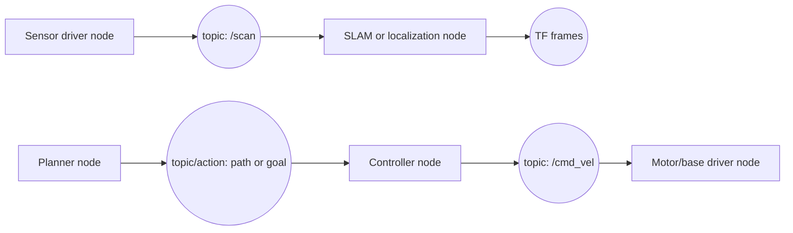
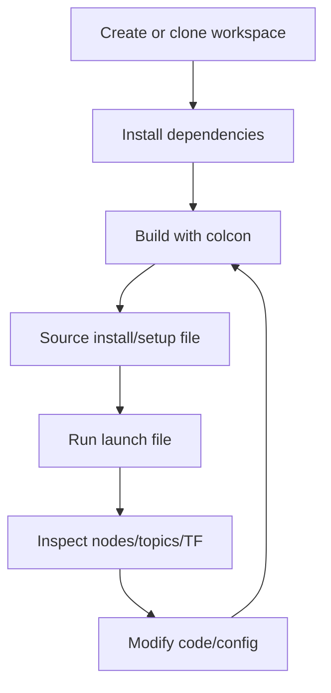
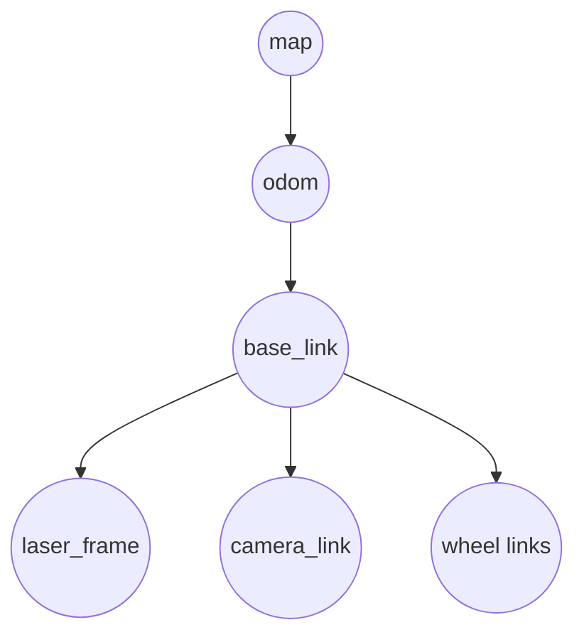

# ROS Beginner Guide

This guide explains ROS from the point of view of someone who wants to build, run, inspect, and modify a robotics project. It is intentionally practical rather than academic.

## One-Sentence Explanation

ROS is a robotics integration framework: it gives different robot programs a standard way to exchange data, start together, configure behavior, replay experiments, and reuse existing drivers and algorithms.

## Mental Model



Diagram convention used in these docs:

- Rectangles represent software actors: nodes, drivers, planners, controllers, launch systems.
- Circles represent communication/data channels: topics, TF data, goals, or command streams.
- Arrows show information or command flow.

## Core Terms

| Term | Meaning | Practical example |
| --- | --- | --- |
| Workspace | Folder containing ROS packages, usually built together. | `robot_ws/src/...` |
| Package | Reusable unit of code/config/interfaces. | `turtlebot4_node`, `turtlebot4_navigation` |
| Node | A running process/component that does one job. | lidar driver, controller, planner |
| Topic | Named stream of messages, usually many-to-many. | `/scan`, `/odom`, `/cmd_vel` |
| Message | Typed data structure used on topics. | `sensor_msgs/msg/LaserScan` |
| Publisher | Node that writes messages to a topic. | lidar publishes `/scan` |
| Subscriber | Node that reads messages from a topic. | costmap subscribes to `/scan` |
| Service | Request/response call for short operations. | start camera, reset map |
| Action | Long-running goal with feedback/result. | navigate to pose, dock |
| Parameter | Runtime configuration value for a node. | controller frequency, robot frame |
| Launch file | Starts multiple nodes with params/remaps. | `nav2.launch.py` |
| TF | Transform tree between coordinate frames. | `map -> odom -> base_link -> lidar` |
| URDF/Xacro | Robot model, links, joints, sensors, frames. | TurtleBot body and sensor placement |
| Bag | Recorded ROS data for replay/debugging. | saved `/scan`, `/odom`, `/tf` session |
| Distro | Versioned ROS release tied to OS support. | Humble, Jazzy, Kilted |

## Typical ROS Project Structure

```text
robot_ws/
  src/
    my_robot_description/     # URDF/Xacro, meshes, robot model
    my_robot_bringup/         # launch files, runtime orchestration
    my_robot_navigation/      # Nav2/SLAM/localization configs
    my_robot_driver/          # hardware interfaces and sensor/base nodes
    my_robot_msgs/            # custom .msg/.srv/.action interfaces
  build/                      # generated by colcon
  install/                    # generated runtime environment
  log/                        # build/test logs
```

Inside a package:

```text
package.xml                  # package metadata and dependencies
CMakeLists.txt or setup.py   # build instructions
launch/                      # launch files
config/                      # YAML parameters
src/                         # C++/Python source code
msg/, srv/, action/          # custom interfaces
urdf/                        # robot description files
```

## Basic Workflow



Common commands:

```bash
cd robot_ws
rosdep install --from-paths src --ignore-src -r -y
colcon build
source install/setup.bash
ros2 launch <package> <file.launch.py>
```

Inspection commands:

```bash
ros2 node list
ros2 topic list
ros2 topic echo /some_topic
ros2 topic info /some_topic
ros2 service list
ros2 action list
ros2 param list
ros2 param get /node_name parameter_name
ros2 run tf2_tools view_frames
```

## Scenario 1: You Built A Robot And Want To Bring It To ROS

### Step 1: Define The Robot Boundary

Before writing ROS code, list the robot interfaces:

| Area | Questions to answer |
| --- | --- |
| Sensors | What sensors exist? Camera, lidar, IMU, encoders, battery, buttons? |
| Actuators | What can be commanded? Wheels, arm joints, gripper, LEDs, screen? |
| Compute | Onboard computer, microcontroller, networked devices? |
| Control loop | Which part needs hard real-time control? Which part can run in Linux user space? |
| Frames | What are the physical coordinate frames and sensor positions? |
| Safety | What stops motion? E-stop, watchdog, bumper, collision monitor? |

### Step 2: Create The Minimum Package Set

Start with boring package boundaries:

```text
my_robot_description   # URDF/Xacro and meshes
my_robot_driver        # hardware I/O node
my_robot_bringup       # launch files
my_robot_navigation    # Nav2/SLAM configs if mobile robot
my_robot_msgs          # only if standard messages are not enough
```

Avoid creating custom messages until standard ROS messages are clearly insufficient.

### Step 3: Publish Standard Sensor Data

Use standard message types where possible:

| Data | Typical topic | Typical message |
| --- | --- | --- |
| Wheel odometry | `/odom` | `nav_msgs/msg/Odometry` |
| Velocity command | `/cmd_vel` | `geometry_msgs/msg/Twist` or stamped variant |
| 2D lidar | `/scan` | `sensor_msgs/msg/LaserScan` |
| Camera image | `/camera/image_raw` | `sensor_msgs/msg/Image` |
| IMU | `/imu` | `sensor_msgs/msg/Imu` |
| Battery | `/battery_state` | `sensor_msgs/msg/BatteryState` |
| Joint states | `/joint_states` | `sensor_msgs/msg/JointState` |

### Step 4: Build The TF Tree

For a mobile robot, a common frame tree is:



If TF is wrong, navigation and visualization will be wrong even if the topics look correct.

### Step 5: Add Bringup And Configuration

Create launch files that start:

- robot description publisher
- sensor drivers
- base driver
- static transforms if needed
- safety/watchdog nodes
- optional navigation, SLAM, localization, visualization

Put tunable behavior in YAML files, not hard-coded source.

### Step 6: Add Higher-Level Capabilities

For a mobile robot:

- Use SLAM Toolbox or another SLAM system to build maps.
- Use AMCL or another localizer to localize on a known map.
- Use Nav2 for planning, control, behavior tree navigation, recovery behaviors, collision monitoring, docking, and waypoint following.
- Record bags early so you can debug without repeatedly running hardware.

## Scenario 2: You Have An Existing ROS Project And Need To Understand It

### First-Pass Reading Order

1. Read `README.md` for intended setup and launch commands.
2. Find all `package.xml` files to identify packages and dependencies.
3. Find `launch/` folders to see runtime entry points.
4. Find `config/` YAML files to see behavior knobs.
5. Find `msg/`, `srv/`, and `action/` folders to understand custom interfaces.
6. Find source files that call `create_publisher`, `create_subscription`, `create_service`, `create_client`, and action APIs.
7. Find URDF/Xacro files to understand frames, sensors, and robot geometry.

### Static Analysis Commands

For this workspace, the helper scripts are:

```bash
python3 tools/ros_repo_discover.py turtlebot4
python3 tools/generate_project_overviews.py turtlebot4 --output-dir project_overviews
```

Use those reports to form a first map before running the project.

### Runtime Inspection Workflow

After building and launching:

```bash
ros2 node list
ros2 topic list
ros2 service list
ros2 action list
ros2 param list
```

Then inspect critical flows:

```bash
ros2 topic info /scan
ros2 topic echo /scan --once
ros2 topic info /odom
ros2 topic info /cmd_vel
ros2 run tf2_tools view_frames
```

For navigation projects, verify:

- `/scan` exists and uses the expected frame.
- `/odom` exists and changes when the robot moves.
- TF has a coherent `map -> odom -> base_link -> sensors` chain.
- `/cmd_vel` or equivalent command topic reaches the base driver.
- Nav2 parameters match the robot footprint, sensor topics, and frames.

### How To Modify Safely

| Goal | Start here | Why |
| --- | --- | --- |
| Change startup behavior | `launch/` | Launch files decide what runs. |
| Tune navigation | `config/nav2.yaml` | Planner/controller/costmap behavior lives here. |
| Tune localization | `config/localization.yaml` | AMCL frame, particle, and scan settings live here. |
| Tune mapping | `config/slam.yaml` | SLAM scan matching and loop closure settings live here. |
| Change robot geometry | `urdf/` or `description/` package | Frames and sensor placement live here. |
| Change topic behavior | source files with publisher/subscriber calls | Defines what data is produced/consumed. |
| Change service/action behavior | source files with service/action clients/servers | Defines commands and long-running goals. |
| Change custom data shape | `msg/`, `srv/`, `action/` | Requires rebuild and downstream updates. |

## Why ROS Feels Hard

ROS complexity usually comes from combining many independent systems:

- Linux and ROS distro compatibility
- workspace build system
- dependency installation
- generated messages
- Python and C++ packages
- launch files and runtime parameters
- middleware discovery
- TF frames
- simulation versus real hardware
- hardware drivers with their own versions

The core idea is simple. The operational stack around it is not.

## Practical Learning Path

1. Learn topics, messages, services, actions, parameters, launch files, and TF.
2. Run a known working demo before creating your own robot.
3. Modify one parameter and observe the effect.
4. Write one publisher and one subscriber.
5. Add one launch file.
6. Record and replay one bag.
7. Only then integrate hardware.

## Minimal Checklist Before Running A Project

- Correct ROS distro installed.
- Dependencies installed with `rosdep`.
- Workspace built with `colcon build`.
- Correct setup file sourced.
- Launch command identified.
- Expected nodes, topics, services, actions, and TF frames known.
- One simple test command prepared, such as echoing `/scan` or sending a small `/cmd_vel`.
- Safety stop available before commanding real hardware.

## Key Takeaway

ROS is best understood as a graph of typed communication between small robot programs. To work effectively, map the graph first, then modify the smallest responsible package, config file, launch file, or node.
